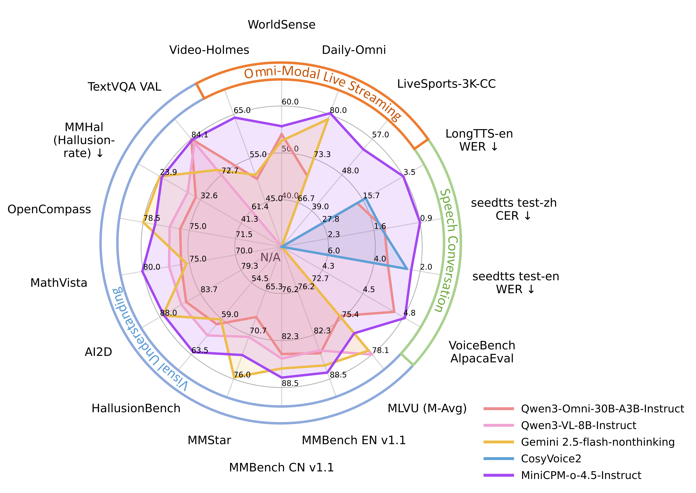
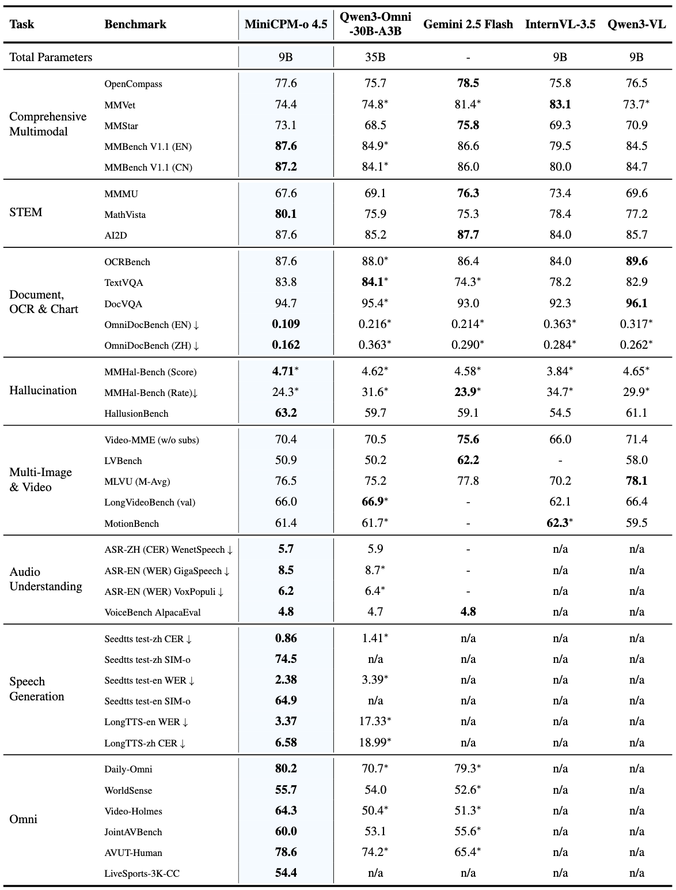
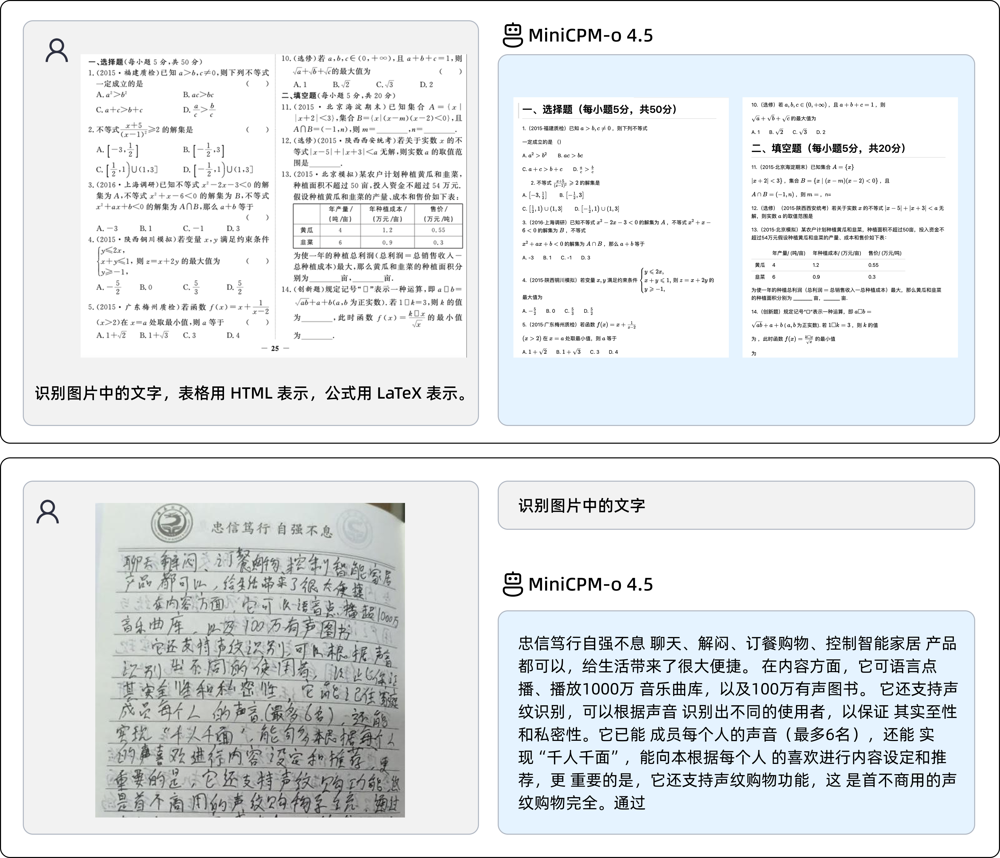
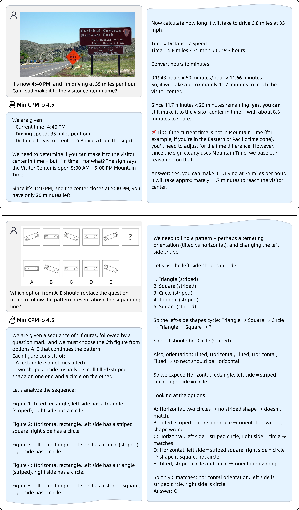
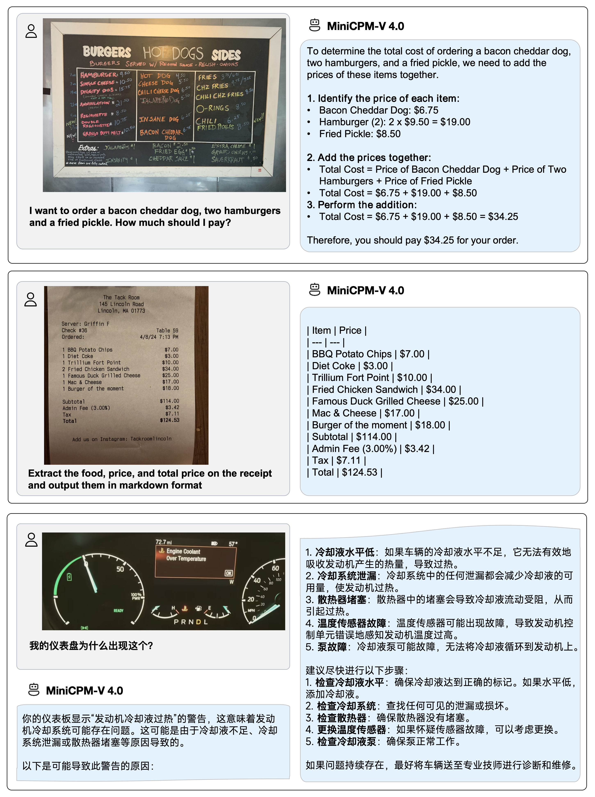

<div align="center">

</img>

**端侧可用的 Gemini 2.5 Flash 级视觉、语音、全双工多模态实时流式大模型**


<!-- <br> -->
<p align="center">
   MiniCPM-o 4.5 <a href="https://huggingface.co/openbmb/MiniCPM-o-4_5">🤗</a> <a href="https://minicpm-omni.openbmb.cn/">🤖</a> | MiniCPM-V 4.0 <a href="https://huggingface.co/openbmb/MiniCPM-V-4">🤗</a>  | <a href="https://github.com/OpenSQZ/MiniCPM-V-Cookbook">🍳 使用指南</a> | 
  <a href="https://huggingface.co/papers/2509.18154">📄 MiniCPM-V 4.5 技术报告 </a>
</p>

</div>

**MiniCPM-o** 是从 **MiniCPM-V** 升级而来的最新一代端侧多模态大模型（MLLM）系列。该系列模型现已支持图像、视频、文本及音频输入，并能够以端到端的方式提供高质量的文本与语音输出。MiniCPM-o 旨在实现卓越的性能与高效的部署。目前该系列中最受关注的模型包括：

- **MiniCPM-o 4.5**: 🔥🔥🔥 该系列最新、最强大的模型。总参数量 9B，在视觉、语音及全双工多模态实时流式交互方面的表现**接近 Gemini 2.5 Flash**，是目前开源社区中功能最全面、性能最强的模型之一。全新的全双工多模态实时流能力意味着输出流（语音和文本）与实时输入流（视频和音频）互不阻塞。这使得 MiniCPM-o 4.5 能够**在实时全模态对话中实现“边看、边听、边说”**，并能**进行如“主动提醒”等主动交互**。优化后的语音模式支持更自然、更具表现力且更稳定的中英双语实时交互，并支持声音克隆。此外，它还进一步增强了 MiniCPM-V 原有的视觉能力，包括出色的 OCR 能力、低幻觉率、以及多语言支持等。为了让这种全双工多模态实时流体验在 PC 等端侧设备上普及，我们还同步推出了**高性能的 llama.cpp-omni 推理框架以及 WebRTC Demo**。
- **MiniCPM-V 4.0**: ⭐️⭐️⭐️ MiniCPM-V 系列中的一款高效模型。该模型拥有 4B 参数，在 OpenCompass 图像理解榜单中超越了 GPT-4.1-mini-20250414。得益于其轻量级的参数规模和高效的架构设计，MiniCPM-V 4.0 是手机端侧部署的理想选择。

## 更新日志 <!-- omit in toc -->

#### 📌 置顶

* [2026.02.03] 🔥🔥🔥 我们开源了 MiniCPM-o 4.5，该模型视觉和语音能力达到了 Gemini 2.5 Flash 水平，同时支持全双工多模态流式交互。欢迎试用！
* [2025.09.18] 📢📢📢 MiniCPM-V 4.5 技术报告已发布! 欢迎点击[这里](./docs/MiniCPM_V_4_5_Technical_Report.pdf)查看.
* [2025.08.26] 🔥🔥🔥 我们开源了 MiniCPM-V 4.5，其视觉性能超越了 GPT-4o-latest、Gemini-2.0 Pro 和 Qwen2.5-VL 72B。它不仅延续并强化了 MiniCPM-V 的热门能力，还带来了诸多实用的新功能。欢迎试用！
* [2025.08.01] 🔥🔥🔥 我们开源了 [MiniCPM-V & o Cookbook](https://github.com/OpenSQZ/MiniCPM-V-CookBook)，提供针对不同人群的全场景使用指南，配合最新的[文档网站](https://minicpm-o.readthedocs.io/en/latest/index.html)上手更轻松！
* [2025.03.01] 🚀🚀🚀 MiniCPM-o 系列的对齐技术 RLAIF-V 被 CVPR 2025 接收了！其[代码](https://github.com/RLHF-V/RLAIF-V)、[数据](https://huggingface.co/datasets/openbmb/RLAIF-V-Dataset)、[论文](https://arxiv.org/abs/2405.17220)均已开源。
* [2025.01.24] 📢📢📢 MiniCPM-o 2.6 技术报告已发布! 欢迎点击[这里](https://openbmb.notion.site/MiniCPM-o-2-6-A-GPT-4o-Level-MLLM-for-Vision-Speech-and-Multimodal-Live-Streaming-on-Your-Phone-185ede1b7a558042b5d5e45e6b237da9)查看.
* [2025.01.19] ⭐️⭐️⭐️ MiniCPM-o 在 GitHub Trending 上登顶， Hugging Face Trending 上也达到了第二！
* [2024.05.23] 🔥🔥🔥 MiniCPM-V 在 GitHub Trending 和 Hugging Face Trending 上登顶！MiniCPM-Llama3-V 2.5 Demo 被 Hugging Face 的 Gradio 官方账户推荐，欢迎点击[这里](https://huggingface.co/spaces/openbmb/MiniCPM-Llama3-V-2_5)体验！

<br>

<details> 
<summary>点击查看完整更新日志。</summary>

* [2025.09.01] ⭐️⭐️⭐️ MiniCPM-V 4.5 已被 [llama.cpp](https://github.com/ggml-org/llama.cpp/pull/15575)、[vLLM](https://github.com/vllm-project/vllm/pull/23586) 和 [LLaMA-Factory](https://github.com/hiyouga/LLaMA-Factory/pull/9022) 等框架官方支持，欢迎从官方入口直接使用！更多框架如 [Ollama](https://github.com/ollama/ollama/pull/12078) 和 [SGLang](https://github.com/sgl-project/sglang/pull/9610) 的官方支持正在持续适配中！
* [2025.08.05] 🚀🚀🚀 我们开源了 MiniCPM-V 4.0，该模型在图像理解能力上超越了 GPT-4.1-mini-20250414。该模型不仅继承了 MiniCPM-V 2.6 的众多实用特性，还大幅提升了推理效率。我们还同步开源了适用于 iPhone 和 iPad 的 iOS 应用，欢迎试用！
* [2025.06.20] ⭐️⭐️⭐️ MiniCPM-o 的 Ollama [官方仓库](https://ollama.com/openbmb)正式支持 MiniCPM-o 2.6 等模型啦，欢迎[一键使用](https://ollama.com/openbmb/minicpm-o2.6)！
* [2025.01.23] 💡💡💡 MiniCPM-o 2.6 现在已被北大团队开发的 [Align-Anything](https://github.com/PKU-Alignment/align-anything)，一个用于对齐全模态大模型的框架集成，支持 DPO 和 SFT 在视觉和音频模态上的微调。欢迎试用！
* [2025.01.19] 📢 **注意!** 我们正在努力将 MiniCPM-o 2.6 的支持合并到 llama.cpp、Ollama、vLLM 的官方仓库，但还未完成。请大家暂时先使用我们提供的 fork 来进行部署：[llama.cpp](https://github.com/OpenBMB/llama.cpp/blob/minicpm-omni/examples/llava/README-minicpmo2.6.md)、[Ollama](https://github.com/OpenBMB/ollama/blob/minicpm-v2.6/examples/minicpm-v2.6/README.md)、[vllm](https://github.com/OpenBMB/MiniCPM-o?tab=readme-ov-file#efficient-inference-with-llamacpp-ollama-vllm)。 **合并完成前，使用官方仓库可能会导致不可预期的问题**。
* [2025.01.17] 我们更新了 MiniCPM-o 2.6 int4 量化版本的使用方式，解决了模型初始化的问题，欢迎点击[这里](https://huggingface.co/openbmb/MiniCPM-o-2_6-int4)试用！
* [2025.01.13] 🔥🔥🔥 我们开源了 MiniCPM-o 2.6，该模型视觉、语音和多模态流式能力达到了 GPT-4o-202405 级别，进一步优化了 MiniCPM-V 2.6 的众多亮点能力，还支持了很多有趣的新功能。欢迎试用！
* [2024.08.17] 🚀🚀🚀 llama.cpp [官方仓库](https://github.com/ggerganov/llama.cpp)正式支持 MiniCPM-V 2.6 啦！点击[这里](https://huggingface.co/openbmb/MiniCPM-V-2_6-gguf)查看各种大小的 GGUF 版本。
* [2024.08.15] MiniCPM-V 2.6 现在支持多图像 SFT。有关更多详细信息，请参阅[微调文档](https://github.com/OpenBMB/MiniCPM-V/tree/main/finetune)
* [2024.08.14] MiniCPM-V 2.6 现在可以通过 SWIFT 框架 [微调](https://github.com/modelscope/ms-swift/issues/1613) 了！
* [2024.08.10] 🚀🚀🚀 llama.cpp [官方仓库](https://github.com/ggerganov/llama.cpp)正式支持 MiniCPM-Llama3-V 2.5 啦！点击[这里](https://huggingface.co/openbmb/MiniCPM-Llama3-V-2_5-gguf/tree/main)查看各种大小的 GGUF 版本。
* [2024.08.06] 🔥🔥🔥 我们开源了 MiniCPM-V 2.6，该模型在单图、多图和视频理解方面取得了优于 GPT-4V 的表现。我们还进一步提升了 MiniCPM-Llama3-V 2.5 的多项亮点能力，并首次支持了 iPad 上的实时视频理解。欢迎试用！
* [2024.08.03] MiniCPM-Llama3-V 2.5 技术报告已发布！欢迎点击[这里](https://arxiv.org/abs/2408.01800)查看。
* [2024.07.19] MiniCPM-Llama3-V 2.5 现已支持[vLLM](#vllm-部署-) ！
* [2024.06.03] 现在，你可以利用多张低显存显卡（12G/16G）进行GPU串行推理。详情请参见该[文档](https://github.com/OpenBMB/MiniCPM-V/blob/main/docs/inference_on_multiple_gpus.md)配置。
* [2024.05.28] 💫 我们现在支持 MiniCPM-Llama3-V 2.5 的 LoRA 微调，更多内存使用统计信息可以在[这里](https://github.com/OpenBMB/MiniCPM-V/tree/main/finetune#model-fine-tuning-memory-usage-statistics)找到。
* [2024.05.28] 💥 MiniCPM-Llama3-V 2.5 现在在 llama.cpp 和 Ollama 中完全支持其功能！**请拉取我们最新的 fork 来使用**：[llama.cpp](https://github.com/OpenBMB/llama.cpp/blob/minicpm-v2.5/examples/minicpmv/README.md) & [ollama](https://github.com/OpenBMB/ollama/tree/minicpm-v2.5/examples/minicpm-v2.5)。我们还发布了各种大小的 GGUF 版本，请点击[这里](https://huggingface.co/openbmb/MiniCPM-Llama3-V-2_5-gguf/tree/main)查看。请注意，**目前官方仓库尚未支持 MiniCPM-Llama3-V 2.5**，我们也正积极推进将这些功能合并到 llama.cpp & ollama 官方仓库，敬请关注！
* [2024.05.25] MiniCPM-Llama3-V 2.5 [支持流式输出和自定义系统提示词](https://huggingface.co/openbmb/MiniCPM-Llama3-V-2_5#usage)了，欢迎试用!
* [2024.05.24] 我们开源了 MiniCPM-Llama3-V 2.5 [gguf](https://huggingface.co/openbmb/MiniCPM-Llama3-V-2_5-gguf)，支持 [llama.cpp](#llamacpp-部署) 推理！实现端侧 6-8 tokens/s 的流畅解码，欢迎试用！
* [2024.05.23] 🔍 我们添加了Phi-3-vision-128k-instruct 与 MiniCPM-Llama3-V 2.5的全面对比，包括基准测试评估、多语言能力和推理效率 🌟📊🌍🚀。点击[这里](./docs/compare_with_phi-3_vision.md)查看详细信息。
* [2024.05.20] 我们开源了 MiniCPM-Llama3-V 2.5，增强了 OCR 能力，支持 30 多种语言，并首次在端侧实现了 GPT-4V 级的多模态能力！我们提供了[高效推理](#手机端部署)和[简易微调](./finetune/readme.md)的支持，欢迎试用！
* [2024.04.23] 我们增加了MiniCPM-V 2.0对 [vLLM](#vllm-部署-) 的支持，欢迎体验！
* [2024.04.18] 我们在 HuggingFace Space 新增了 MiniCPM-V 2.0 的 [demo](https://huggingface.co/spaces/openbmb/MiniCPM-V-2)，欢迎体验！
* [2024.04.17] MiniCPM-V 2.0 现在支持用户部署本地 [WebUI Demo](#本地webui-demo部署) 了，欢迎试用!
* [2024.04.15] MiniCPM-V 2.0 现在可以通过 SWIFT 框架 [微调](https://github.com/modelscope/swift/blob/main/docs/source/Multi-Modal/minicpm-v-2最佳实践.md) 了，支持流式输出!
* [2024.04.12] 我们开源了 MiniCPM-V 2.0，该模型刷新了 OCRBench 开源模型最佳成绩，在场景文字识别能力上比肩 Gemini Pro，同时还在综合了 11 个主流多模态大模型评测基准的 <a href="https://rank.opencompass.org.cn/leaderboard-multimodal">OpenCompass</a> 榜单上超过了 Qwen-VL-Chat 10B、CogVLM-Chat 17B 和 Yi-VL 34B 等更大参数规模的模型！点击 <a href="https://openbmb.vercel.app/minicpm-v-2">这里</a> 查看 MiniCPM-V 2.0 技术博客。
* [2024.03.14] MiniCPM-V 现在支持 SWIFT 框架下的[微调](https://github.com/modelscope/swift/blob/main/docs/source/Multi-Modal/minicpm-v最佳实践.md)了，感谢 [Jintao](https://github.com/Jintao-Huang) 的贡献！
* [2024.03.01] MiniCPM-V 现在支持在 Mac 电脑上进行部署！
* [2024.02.01] 我们开源了 MiniCPM-V 和 OmniLMM-12B，分别可以支持高效的端侧部署和同规模领先的多模态能力！

</details>

## 目录 <!-- omit in toc -->

- [MiniCPM-o 4.5](#minicpm-o-45)
- [MiniCPM-V 4.0](#minicpm-v-40)
- [MiniCPM-V \& o 使用手册](#minicpm-v--o-使用手册)
- [模型库](#模型库)
- [简易推理](#简易推理)
  - [模型初始化](#模型初始化)
  - [双工全模态模式](#双工全模态模式)
  - [单工全模态模式](#单工全模态模式)
  - [语音与音频模式](#语音与音频模式)
- [框架支持](#框架支持)
  - [FlagOS](#flagos)
  - [vLLM、SGLang、llama.cpp、Ollama](#vllmsglangllamacppollama)
  - [LLaMA-Factory、SWIFT](#llama-factoryswift)
- [基于 MiniCPM-V \& MiniCPM-o 的更多项目](#基于-minicpm-v--minicpm-o-的更多项目)
- [模型局限性](#模型局限性)
- [致谢](#致谢)

## MiniCPM-o 4.5

MiniCPM-o 4.5 是 MiniCPM-o 系列中最新且性能最强的模型。该模型采用端到端方式构建，基于 SigLip2、Whisper-medium、CosyVoice2 和 Qwen3-8B，总参数量为 9B。其在性能上实现了显著提升，并引入了全新的全双工多模态实时流式交互能力。MiniCPM-o 4.5 的主要特性包括：

- 🔥 **领先的视觉能力**
  MiniCPM-o 4.5 在涵盖 8 个主流评测基准的 OpenCompass 综合评估中获得了 78.2 的平均分。**仅凭 9B 参数，其视觉理解能力超越了 GPT-4o、Gemini 2.0 Pro 等广泛使用的商业模型**，接近 Gemini 2.5 Flash 水平。 该模型在单一模型中同时支持指令模式和思考模式，能够更好地平衡不同使用场景下的效率与性能。
- 🎙 **强大的语音能力**
  MiniCPM-o 4.5 支持**音色可配置的中英双语实时语音对话**。其语音对话**更加自然、富有表现力且稳定**。该模型还支持更多有趣的功能，如**通过简单的参考音频进行声音克隆和角色扮演**，其声音克隆表现甚至超越了 CosyVoice2 等优秀 TTS 工具。
- 🎬 **全双工及主动多模态实时流式交互能力**
  MiniCPM-o 4.5 的一项核心新特性是能够以端到端的方式同时处理实时连续的视频和音频输入流，并同步生成文本和语音输出流，且互不阻塞。这**使得 MiniCPM-o 4.5 能够同时“看、听、说”**，提供流畅的实时全模态对话体验。除了被动响应，模型还能进行**主动交互**，例如基于对场景的实时持续理解，主动发起提醒或评论。
- 💪 **高效率、强悍的 OCR 能力及其他特性**
  MiniCPM-o 4.5 进一步优化了 MiniCPM-V 系列的众多视觉能力，可以高效处理**任意长宽比的高分辨率图像**（最高 180 万像素）和**高帧率视频**（最高 10fps）。其在 OmniDocBench **端到端英文文档解析测试中达到了业内顶尖水平**，超越了 Gemini-3 Flash 和 GPT-5 等商业模型以及 DeepSeek-OCR 2 等专用工具。此外，它还具备**可信的多模态行为**，在 MMHal-Bench 上与 Gemini 2.5 Flash 相当，并**支持超过 30 种语言**。
- 💫 **便捷的使用体验**
  MiniCPM-o 4.5 提供了多种便捷的使用方式：(1) 支持 [llama.cpp](https://github.com/OpenSQZ/MiniCPM-V-CookBook/blob/main/deployment/llama.cpp/minicpm-o4_5_llamacpp.md) 和 [Ollama](https://github.com/OpenSQZ/MiniCPM-V-CookBook/blob/main/deployment/ollama/minicpm-o4_5_ollama.md)，以便在本地设备上进行高效的 CPU 推理；(2) 提供 16 种尺寸的 [int4](https://github.com/OpenSQZ/MiniCPM-V-CookBook/blob/main/quantization/awq/minicpm-o4_5_awq_quantize.md) 和 [GGUF](https://github.com/OpenSQZ/MiniCPM-V-CookBook/blob/main/quantization/gguf/minicpm-o4_5_gguf_quantize.md) 格式量化模型；(3) 支持 [vLLM](https://github.com/OpenSQZ/MiniCPM-V-CookBook/blob/main/deployment/vllm/minicpm-o4_5_vllm.md) 和 [SGLang](https://github.com/OpenSQZ/MiniCPM-V-CookBook/blob/main/deployment/sglang/MiniCPM-o4_5_sglang.md)，实现高吞吐、显存高效的推理；(4)[FlagOS](#FlagOS) 使用 FlagOS 统一多芯片后端插件；(5) 支持通过 [LLaMA-Factory](https://github.com/OpenSQZ/MiniCPM-V-CookBook/blob/main/finetune/llama-factory/finetune_llamafactory.md) 在新领域和任务上进行微调；(6) 提供服务器端[在线 Web Demo](https://github.com/OpenSQZ/MiniCPM-V-CookBook/blob/main/demo/web_demo/gradio/README_o45.md)。我们还同步推出了高性能的 [llama.cpp-omni](https://github.com/tc-mb/llama.cpp-omni) 推理框架以及 [WebRTC Demo](https://github.com/OpenSQZ/MiniCPM-V-CookBook/blob/main/demo/web_demo/WebRTC_Demo/README_zh.md)，**让全双工多模态实时流式交互体验在 [PC](https://github.com/tc-mb/llama.cpp-omni/blob/master/tools/omni/README.md) 等本地设备上触手可及**。

**模型架构。**

- **端到端全模态架构。** 各模态的编码器/解码器与大语言模型通过稠密特征以端到端的方式进行紧密连接。这种设计实现了更好的信息流转与控制，有助于在训练过程中充分挖掘和利用丰富的多模态知识。
- **全双工多模态实时流机制。** （1）我们将离线模态编码器/解码器转化为支持流式输入/输出的在线全双工版本。语音解码器采用文本与语音 token 交错建模的方式，支持全双工语音生成（即与新输入实时同步），同时也提升了长语音（如超过 1 分钟）生成的稳定性。（2）时分复用：**我们在毫秒级时间线上同步所有输入和输出流**，并利用时分复用机制在语言模型主干中进行统一建模。该机制将并行的全模态流划分为微小周期性时间片内的顺序信息组，从而实现高效的全模态流式处理。
- **主动交互机制。** 语言模型模块会持续监控输入的视频和音频流，并以 1Hz 的频率自动决策是否发言。这种高频决策能力结合全双工特性，是实现主动提醒、主动评论等“主动交互”能力的关键。
- **可配置语音建模设计。** 我们延续了 MiniCPM-o 2.6 的多模态系统提示词设计，同时包含文本系统提示词和音频系统提示词（用于指定音色）。这使得模型在推理阶段能够通过简单的参考音频实现声音克隆和角色扮演。

<div align="center">
  
</div>

### 性能评估  <!-- omit in toc -->

<div align="center">
  
</div>

<div align="center">
  
</div>
<strong>说明</strong>: * 为自测结果，其余为引用的公开结果。n/a 表示该模型不支持对应模态或任务。所有结果来自指令模式或对应模型指令版本权重。

&emsp;
<br>

<details>
<summary>点击查看视觉理解能力详细评测结果。</summary>

**图像理解能力（指令模式）**
  <div align="center">
  <table style="margin: 0px auto;">
<tr>
  <th nowrap="nowrap" align="left"><b>Model</b></th>
  <th nowrap="nowrap"><b>OpenCompass</b></th>
  <th nowrap="nowrap"><b>MMBench EN v1.1</b></th>
  <th nowrap="nowrap"><b>MMBench CN v1.1</b></th>
  <th nowrap="nowrap"><b>MathVista</b></th>
  <th nowrap="nowrap"><b>MMVet</b></th>
  <th nowrap="nowrap"><b>MMMU</b></th>
  <th nowrap="nowrap"><b>MMStar</b></th>
  <th nowrap="nowrap"><b>HallusionBench</b></th>
  <th nowrap="nowrap"><b>AI2D</b></th>
  <th nowrap="nowrap"><b>OCRBench</b></th>
  <th nowrap="nowrap"><b>TextVQA_VAL</b></th>
  <th nowrap="nowrap"><b>DocVQA_VAL</b></th>
  <th nowrap="nowrap"><b>MMT-Bench_VAL</b></th>
  <th nowrap="nowrap"><b>MM-IFEval</b></th>
  <th nowrap="nowrap"><b>Mantis-Eval</b></th>
  <th nowrap="nowrap"><b>MuirBench</b></th>
  <th nowrap="nowrap"><b>MMSI-Bench</b></th>
  <th nowrap="nowrap"><b>MMHal-Score</b></th>
  <th nowrap="nowrap"><b>MMHal-Hallrate↓</b></th>
</tr>
<tr>
  <td nowrap="nowrap" align="left">Gemini2.5-Flash-Nonthinking</td>
  <td align="center"><b>78.5</b></td>
  <td align="center"><ins>86.6</ins></td>
  <td align="center"><ins>86.0</ins></td>
  <td align="center">75.3</td>
  <td align="center"><ins>81.4</ins><sup>*</sup></td>
  <td align="center"><b>76.3</b></td>
  <td align="center"><b>75.8</b></td>
  <td align="center">59.1</td>
  <td align="center"><b>87.7</b></td>
  <td align="center">864</td>
  <td align="center">74.3<sup>*</sup></td>
  <td align="center">93.0</td>
  <td align="center"><ins>70.0</ins><sup>*</sup></td>
  <td align="center"><b>75.8<sup>*</sup></b></td>
  <td align="center">72.8<sup>*</sup></td>
  <td align="center"><b>74.5<sup>*</sup></b></td>
  <td align="center">12.1<sup>*</sup></td>
  <td align="center"><ins>4.6</ins><sup>*</sup></td>
  <td align="center"><b>23.9<sup>*</sup></b></td>
</tr>
<tr>
  <td nowrap="nowrap" align="left">InternVL-3.5-8B</td>
  <td align="center">75.8</td>
  <td align="center">79.5</td>
  <td align="center">80.0<sup>*</sup></td>
  <td align="center"><ins>78.4</ins></td>
  <td align="center"><b>83.1</b></td>
  <td align="center"><ins>73.4</ins></td>
  <td align="center">69.3</td>
  <td align="center">54.5</td>
  <td align="center">84.0</td>
  <td align="center">840</td>
  <td align="center">78.2</td>
  <td align="center">92.3</td>
  <td align="center">66.7</td>
  <td align="center">56.3<sup>*</sup></td>
  <td align="center">70.5</td>
  <td align="center">55.8</td>
  <td align="center">-</td>
  <td align="center">3.8<sup>*</sup></td>
  <td align="center">34.7<sup>*</sup></td>
</tr>
<tr>
  <td nowrap="nowrap" align="left">Qwen3-VL-8B-Instruct</td>
  <td align="center">76.5</td>
  <td align="center">84.5</td>
  <td align="center">84.7</td>
  <td align="center">77.2</td>
  <td align="center">73.7<sup>*</sup></td>
  <td align="center">69.6</td>
  <td align="center">70.9</td>
  <td align="center"><ins>61.1</ins></td>
  <td align="center">85.7</td>
  <td align="center"><b>896</b></td>
  <td align="center">82.9<sup>*</sup></td>
  <td align="center"><b>96.1</b></td>
  <td align="center">60.9<sup>*</sup></td>
  <td align="center">59.4<sup>*</sup></td>
  <td align="center">74.2<sup>*</sup></td>
  <td align="center">64.4</td>
  <td align="center">11.3<sup>*</sup></td>
  <td align="center"><b>4.7<sup>*</sup></b></td>
  <td align="center">29.9<sup>*</sup></td>
</tr>
<tr>
  <td nowrap="nowrap" align="left">Qwen3-Omni-30B-A3B-Instruct</td>
  <td align="center">75.7</td>
  <td align="center">84.9<sup>*</sup></td>
  <td align="center">84.1<sup>*</sup></td>
  <td align="center">75.9</td>
  <td align="center">74.8<sup>*</sup></td>
  <td align="center">69.1</td>
  <td align="center">68.5</td>
  <td align="center">59.7</td>
  <td align="center">85.2</td>
  <td align="center"><ins>880</ins><sup>*</sup></td>
  <td align="center"><b>84.1<sup>*</sup></b></td>
  <td align="center"><ins>95.4</ins><sup>*</sup></td>
  <td align="center"><b>70.4<sup>*</sup></b></td>
  <td align="center">65.7<sup>*</sup></td>
  <td align="center"><ins>78.3</ins><sup>*</sup></td>
  <td align="center">61.9<sup>*</sup></td>
  <td align="center"><ins>14.2</ins><sup>*</sup></td>
  <td align="center"><ins>4.6</ins><sup>*</sup></td>
  <td align="center">31.6<sup>*</sup></td>
</tr>
<tr>
  <td nowrap="nowrap" align="left">MiniCPM-o 4.5-Instruct</td>
  <td align="center"><ins>77.6</ins></td>
  <td align="center"><b>87.6</b></td>
  <td align="center"><b>87.2</b></td>
  <td align="center"><b>80.1</b></td>
  <td align="center">74.4</td>
  <td align="center">67.6</td>
  <td align="center"><ins>73.1</ins></td>
  <td align="center"><b>63.2</b></td>
  <td align="center"><ins>87.6</ins></td>
  <td align="center">876</td>
  <td align="center"><ins>83.8</ins></td>
  <td align="center">94.7</td>
  <td align="center">69.7</td>
  <td align="center"><ins>66.3</ins></td>
  <td align="center"><b>79.7</b></td>
  <td align="center"><ins>72.0</ins></td>
  <td align="center"><b>16.6</b></td>
  <td align="center"><b>4.7</b></td>
  <td align="center"><ins>24.3</ins></td>
</tr>
  </table>
  </div>
  
**图像理解能力（思考模式）**
  <div align="center">
  <table style="margin: 0px auto;">
<tr>
  <th nowrap="nowrap" align="left"><b>Model</b></th>
  <th nowrap="nowrap"><b>OpenCompass</b></th>
  <th nowrap="nowrap"><b>MMBench EN v1.1</b></th>
  <th nowrap="nowrap"><b>MMBench CN v1.1</b></th>
  <th nowrap="nowrap"><b>MathVista</b></th>
  <th nowrap="nowrap"><b>MMVet</b></th>
  <th nowrap="nowrap"><b>MMMU</b></th>
  <th nowrap="nowrap"><b>MMStar</b></th>
  <th nowrap="nowrap"><b>HallusionBench</b></th>
  <th nowrap="nowrap"><b>AI2D</b></th>
  <th nowrap="nowrap"><b>OCRBench</b></th>
  <th nowrap="nowrap"><b>TextVQA_VAL</b></th>
  <th nowrap="nowrap"><b>DocVQA_VAL</b></th>
  <th nowrap="nowrap"><b>MMT-Bench_VAL</b></th>
  <th nowrap="nowrap"><b>MM-IFEval</b></th>
</tr>
<tr>
  <td nowrap="nowrap" align="left">Gemini2.5-Flash-Thinking</td>
  <td align="center"><b>79.9</b></td>
  <td align="center">87.1</td>
  <td align="center">87.3</td>
  <td align="center">79.4</td>
  <td align="center"><b>81.2<sup>*</sup></b></td>
  <td align="center"><ins>77.7</ins></td>
  <td align="center"><b>76.5</b></td>
  <td align="center">63.5</td>
  <td align="center"><ins>88.7</ins></td>
  <td align="center">853</td>
  <td align="center">73.8<sup>*</sup></td>
  <td align="center">92.8</td>
  <td align="center">70.7<sup>*</sup></td>
  <td align="center"><ins>75.7</ins><sup>*</sup></td>
</tr>
<tr>
  <td nowrap="nowrap" align="left">GPT-5</td>
  <td align="center"><ins>79.7</ins></td>
  <td align="center">85.5<sup>*</sup></td>
  <td align="center">85.6<sup>*</sup></td>
  <td align="center"><b>81.9</b></td>
  <td align="center"><ins>77.6</ins></td>
  <td align="center"><b>81.8</b></td>
  <td align="center"><ins>75.7</ins></td>
  <td align="center"><ins>65.2</ins></td>
  <td align="center"><b>89.5</b></td>
  <td align="center">807</td>
  <td align="center">77.8<sup>*</sup></td>
  <td align="center">91.3<sup>*</sup></td>
  <td align="center"><b>72.7<sup>*</sup></b></td>
  <td align="center"><b>83.1<sup>*</sup></b></td>
</tr>
<tr>
  <td nowrap="nowrap" align="left">Qwen3-VL-8B-Thinking</td>
  <td align="center">77.3</td>
  <td align="center">85.3</td>
  <td align="center">85.5</td>
  <td align="center"><ins>81.4</ins></td>
  <td align="center">69.8<sup>*</sup></td>
  <td align="center">74.1</td>
  <td align="center">75.3</td>
  <td align="center"><b>65.4</b></td>
  <td align="center">84.9</td>
  <td align="center">819</td>
  <td align="center">77.8<sup>*</sup></td>
  <td align="center"><b>95.3</b></td>
  <td align="center">68.1<sup>*</sup></td>
  <td align="center">73.5<sup>*</sup></td>
</tr>
<tr>
  <td nowrap="nowrap" align="left">Qwen3-Omni-30B-A3B-Thinking</td>
  <td align="center">78.5</td>
  <td align="center"><ins>88.2</ins><sup>*</sup></td>
  <td align="center"><b>87.7<sup>*</sup></b></td>
  <td align="center">80.0</td>
  <td align="center">74.8<sup>*</sup></td>
  <td align="center">75.6</td>
  <td align="center">74.9</td>
  <td align="center">62.8</td>
  <td align="center">86.1</td>
  <td align="center"><ins>859</ins><sup>*</sup></td>
  <td align="center"><b>80.8<sup>*</sup></b></td>
  <td align="center"><ins>94.2</ins><sup>*</sup></td>
  <td align="center"><ins>70.9</ins><sup>*</sup></td>
  <td align="center">69.9<sup>*</sup></td>
</tr>
<tr>
  <td nowrap="nowrap" align="left">MiniCPM-o 4.5-Thinking</td>
  <td align="center">78.2</td>
  <td align="center"><b>89.0</b></td>
  <td align="center"><ins>87.6</ins></td>
  <td align="center">81.0</td>
  <td align="center">73.6</td>
  <td align="center">70.2</td>
  <td align="center">73.6</td>
  <td align="center">62.6</td>
  <td align="center">88.5</td>
  <td align="center"><b>879</b></td>
  <td align="center"><ins>79.8</ins></td>
  <td align="center">92.3</td>
  <td align="center">69.7</td>
  <td align="center">68.2</td>
</tr>
  </table>
  </div>

**视频理解能力**
  <div align="center">
  <table style="margin: 0px auto;">
<tr>
  <th nowrap="nowrap" align="left"><b>Model</b></th>
  <th nowrap="nowrap"><b>Video-MME<br>(w/o subs)</b></th>
  <th nowrap="nowrap"><b>LVBench</b></th>
  <th nowrap="nowrap"><b>MLVU<br>(M-Avg)</b></th>
  <th nowrap="nowrap"><b>LongVideoBench<br>(val)</b></th>
  <th nowrap="nowrap"><b>MotionBench</b></th>
</tr>
<tr>
  <td nowrap="nowrap" align="left">Gemini2.5-Flash-Nonthinking</td>
  <td align="center"><b>75.6</b></td>
  <td align="center"><b>62.2</b></td>
  <td align="center"><b>77.8</b></td>
  <td align="center">-</td>
  <td align="center">-</td>
</tr>
<tr>
  <td nowrap="nowrap" align="left">InternVL-3.5-8B</td>
  <td align="center">66.0</td>
  <td align="center">-</td>
  <td align="center">70.2</td>
  <td align="center">62.1</td>
  <td align="center"><b>62.3<sup>*</sup></b></td>
</tr>
<tr>
  <td nowrap="nowrap" align="left">Qwen3-Omni-30B-A3B-Instruct</td>
  <td align="center"><ins>70.5</ins></td>
  <td align="center">50.2</td>
  <td align="center">75.2</td>
  <td align="center"><b>66.9<sup>*</sup></b></td>
  <td align="center"><ins>61.7</ins><sup>*</sup></td>
</tr>
<tr>
  <td nowrap="nowrap" align="left">MiniCPM-o 4.5-Instruct</td>
  <td align="center">70.4</td>
  <td align="center"><ins>50.9</ins></td>
  <td align="center"><ins>76.5</ins></td>
  <td align="center"><ins>66.0</ins></td>
  <td align="center">61.4</td>
</tr>
  </table>
  </div>

</details>

<details>
<summary>点击查看文档解析能力详细评测结果。</summary>

**OmniDocBench**
  <div align="center">
  <table style="margin: 0px auto;">
<tr>
  <th nowrap="nowrap" align="left" rowspan="2"><b>Method Type</b></th>
  <th nowrap="nowrap" rowspan="2"><b>Methods</b></th>
  <th colspan="2"><b>OverallEdit↓</b></th>
  <th colspan="2"><b>TextEdit↓</b></th>
  <th colspan="2"><b>FormulaEdit↓</b></th>
  <th colspan="2"><b>TableTEDS↑</b></th>
  <th colspan="2"><b>TableEdit↓</b></th>
  <th colspan="2"><b>Read OrderEdit↓</b></th>
</tr>
<tr>
  <th nowrap="nowrap"><b>EN</b></th>
  <th nowrap="nowrap"><b>ZH</b></th>
  <th nowrap="nowrap"><b>EN</b></th>
  <th nowrap="nowrap"><b>ZH</b></th>
  <th nowrap="nowrap"><b>EN</b></th>
  <th nowrap="nowrap"><b>ZH</b></th>
  <th nowrap="nowrap"><b>EN</b></th>
  <th nowrap="nowrap"><b>ZH</b></th>
  <th nowrap="nowrap"><b>EN</b></th>
  <th nowrap="nowrap"><b>ZH</b></th>
  <th nowrap="nowrap"><b>EN</b></th>
  <th nowrap="nowrap"><b>ZH</b></th>
</tr>
<tr>
  <td nowrap="nowrap" align="left" rowspan="2">Pipeline</td>
  <td align="center">MinerU 2.5</td>
  <td align="center">0.117<sup>*</sup></td>
  <td align="center">0.172<sup>*</sup></td>
  <td align="center">0.051<sup>*</sup></td>
  <td align="center">0.08<sup>*</sup></td>
  <td align="center"><ins>0.256</ins><sup>*</sup></td>
  <td align="center">0.455<sup>*</sup></td>
  <td align="center">85.9<sup>*</sup></td>
  <td align="center">89.4<sup>*</sup></td>
  <td align="center">0.115<sup>*</sup></td>
  <td align="center">0.081<sup>*</sup></td>
  <td align="center">0.047<sup>*</sup></td>
  <td align="center">0.072<sup>*</sup></td>
</tr>
<tr>
  <td nowrap="nowrap" align="center">PaddleOCR-VL</td>
  <td align="center"><b>0.105</b></td>
  <td align="center"><ins>0.126</ins></td>
  <td align="center"><ins>0.041</ins></td>
  <td align="center"><b>0.062</b></td>
  <td align="center"><b>0.241</b></td>
  <td align="center"><b>0.316</b></td>
  <td align="center">88</td>
  <td align="center"><ins>92.1</ins></td>
  <td align="center"><ins>0.093</ins></td>
  <td align="center"><ins>0.062</ins></td>
  <td align="center">0.045</td>
  <td align="center"><ins>0.063</ins></td>
</tr>
<tr>
  <td nowrap="nowrap" align="left"></td>
  <td align="center"></td>
  <td align="center"></td>
  <td align="center"></td>
  <td align="center"></td>
  <td align="center"></td>
  <td align="center"></td>
  <td align="center"></td>
  <td align="center"></td>
  <td align="center"></td>
  <td align="center"></td>
  <td align="center"></td>
  <td align="center"></td>
  <td align="center"></td>
</tr>
<tr>
  <td nowrap="nowrap" align="left" rowspan="11">End-to-end Model</td>
  <td align="center">Qwen2.5-VL-72B</td>
  <td align="center">0.214</td>
  <td align="center">0.261</td>
  <td align="center">0.092</td>
  <td align="center">0.18</td>
  <td align="center">0.315</td>
  <td align="center">0.434</td>
  <td align="center">82.9</td>
  <td align="center">83.9</td>
  <td align="center">0.341</td>
  <td align="center">0.262</td>
  <td align="center">0.106</td>
  <td align="center">0.168</td>
</tr>
<tr>
  <td nowrap="nowrap" align="center">GPT 5</td>
  <td align="center">0.218<sup>*</sup></td>
  <td align="center">0.33<sup>*</sup></td>
  <td align="center">0.139<sup>*</sup></td>
  <td align="center">0.344<sup>*</sup></td>
  <td align="center">0.396<sup>*</sup></td>
  <td align="center">0.555<sup>*</sup></td>
  <td align="center">77.55<sup>*</sup></td>
  <td align="center">73.09<sup>*</sup></td>
  <td align="center">0.188<sup>*</sup></td>
  <td align="center">0.196<sup>*</sup></td>
  <td align="center">0.151<sup>*</sup></td>
  <td align="center">0.227<sup>*</sup></td>
</tr>
<tr>
  <td nowrap="nowrap" align="center">Gemini2.5-Flash-Nonthinking</td>
  <td align="center">0.214<sup>*</sup></td>
  <td align="center">0.29<sup>*</sup></td>
  <td align="center">0.159<sup>*</sup></td>
  <td align="center">0.273<sup>*</sup></td>
  <td align="center">0.368<sup>*</sup></td>
  <td align="center">0.524<sup>*</sup></td>
  <td align="center">80.9<sup>*</sup></td>
  <td align="center">85.5<sup>*</sup></td>
  <td align="center">0.197<sup>*</sup></td>
  <td align="center">0.167<sup>*</sup></td>
  <td align="center">0.132<sup>*</sup></td>
  <td align="center">0.195<sup>*</sup></td>
</tr>
<tr>
  <td align="center">Gemini-2.5-Pro-Nonthinking</td>
  <td align="center">0.148<sup>*</sup></td>
  <td align="center">0.212<sup>*</sup></td>
  <td align="center">0.055<sup>*</sup></td>
  <td align="center">0.168<sup>*</sup></td>
  <td align="center">0.356<sup>*</sup></td>
  <td align="center">0.439<sup>*</sup></td>
  <td align="center">85.8<sup>*</sup></td>
  <td align="center">86.4<sup>*</sup></td>
  <td align="center">0.13<sup>*</sup></td>
  <td align="center">0.119<sup>*</sup></td>
  <td align="center">0.049<sup>*</sup></td>
  <td align="center">0.121<sup>*</sup></td>
</tr>
<tr>
  <td nowrap="nowrap" align="center">Gemini-3 Flash-Nonthinking</td>
  <td align="center">0.155<sup>*</sup></td>
  <td align="center">0.201<sup>*</sup></td>
  <td align="center">0.138<sup>*</sup></td>
  <td align="center">0.255<sup>*</sup></td>
  <td align="center">0.297<sup>*</sup></td>
  <td align="center">0.351<sup>*</sup></td>
  <td align="center">86.4<sup>*</sup></td>
  <td align="center">89.8<sup>*</sup></td>
  <td align="center">0.116<sup>*</sup></td>
  <td align="center">0.1<sup>*</sup></td>
  <td align="center">0.072<sup>*</sup></td>
  <td align="center">0.099<sup>*</sup></td>
</tr>
<tr>
  <td nowrap="nowrap" align="center">doubao-1-5-thinking-vision-pro-250428</td>
  <td align="center">0.14</td>
  <td align="center">0.162</td>
  <td align="center">0.043</td>
  <td align="center">0.085</td>
  <td align="center">0.295</td>
  <td align="center">0.384</td>
  <td align="center">83.3</td>
  <td align="center">89.3</td>
  <td align="center">0.165</td>
  <td align="center">0.085</td>
  <td align="center">0.058</td>
  <td align="center">0.094</td>
</tr>
<tr>
  <td align="center">dots.ocr</td>
  <td align="center">0.125</td>
  <td align="center">0.16</td>
  <td align="center"><b>0.032</b></td>
  <td align="center"><ins>0.066</ins></td>
  <td align="center">0.329</td>
  <td align="center">0.416</td>
  <td align="center"><ins>88.6</ins></td>
  <td align="center">89</td>
  <td align="center">0.099</td>
  <td align="center">0.092</td>
  <td align="center"><ins>0.04</ins></td>
  <td align="center">0.067</td>
</tr>
<tr>
  <td nowrap="nowrap" align="center">HunyuanOCR</td>
  <td align="center">0.12<sup>*</sup></td>
  <td align="center"><b>0.125<sup>*</sup></b></td>
  <td align="center">0.046<sup>*</sup></td>
  <td align="center">0.071<sup>*</sup></td>
  <td align="center">0.288<sup>*</sup></td>
  <td align="center"><ins>0.33</ins><sup>*</sup></td>
  <td align="center"><b>89.6<sup>*</sup></b></td>
  <td align="center"><b>94.4<sup>*</sup></b></td>
  <td align="center"><b>0.089<sup>*</sup></b></td>
  <td align="center"><b>0.045<sup>*</sup></b></td>
  <td align="center">0.055<sup>*</sup></td>
  <td align="center"><b>0.056<sup>*</sup></b></td>
</tr>
<tr>
  <td nowrap="nowrap" align="center">DeepSeek-OCR 2</td>
  <td align="center">0.119<sup>*</sup></td>
  <td align="center">0.146<sup>*</sup></td>
  <td align="center"><ins>0.041</ins><sup>*</sup></td>
  <td align="center">0.08<sup>*</sup></td>
  <td align="center"><ins>0.256</ins><sup>*</sup></td>
  <td align="center">0.345<sup>*</sup></td>
  <td align="center">82.6<sup>*</sup></td>
  <td align="center">89.9<sup>*</sup></td>
  <td align="center">0.123<sup>*</sup></td>
  <td align="center">0.078<sup>*</sup></td>
  <td align="center">0.055<sup>*</sup></td>
  <td align="center">0.081<sup>*</sup></td>
</tr>
<tr>
  <td nowrap="nowrap" align="center">Qwen3-Omni-30B-A3B-Instruct</td>
  <td align="center">0.216<sup>*</sup></td>
  <td align="center">0.363<sup>*</sup></td>
  <td align="center">0.128<sup>*</sup></td>
  <td align="center">0.337<sup>*</sup></td>
  <td align="center">0.402<sup>*</sup></td>
  <td align="center">0.529<sup>*</sup></td>
  <td align="center">77.3<sup>*</sup></td>
  <td align="center">71.8<sup>*</sup></td>
  <td align="center">0.181<sup>*</sup></td>
  <td align="center">0.255<sup>*</sup></td>
  <td align="center">0.152<sup>*</sup></td>
  <td align="center">0.332<sup>*</sup></td>
</tr>
<tr>
  <td nowrap="nowrap" align="center">MiniCPM-o 4.5-Instruct</td>
  <td align="center"><ins>0.109</ins></td>
  <td align="center">0.162</td>
  <td align="center">0.046</td>
  <td align="center">0.078</td>
  <td align="center">0.257</td>
  <td align="center">0.41</td>
  <td align="center">86.8</td>
  <td align="center">88.9</td>
  <td align="center">0.097</td>
  <td align="center">0.084</td>
  <td align="center"><b>0.037</b></td>
  <td align="center">0.074</td>
</tr>
  </table>
  </div>
</details>

<details>
<summary>点击查看文本能力详细评测结果。</summary>

**文本能力**
  <div align="center">
  <table style="margin: 0px auto;">
<tr>
  <th nowrap="nowrap" align="left"><b>Model</b></th>
  <th nowrap="nowrap"><b>IFEval-PLS</b></th>
  <th nowrap="nowrap"><b>BBH</b></th>
  <th nowrap="nowrap"><b>CMMLU</b></th>
  <th nowrap="nowrap"><b>MMLU</b></th>
  <th nowrap="nowrap"><b>HumanEval</b></th>
  <th nowrap="nowrap"><b>MBPP</b></th>
  <th nowrap="nowrap"><b>Math500</b></th>
  <th nowrap="nowrap"><b>GSM8K</b></th>
  <th nowrap="nowrap"><b>Avg</b></th>
</tr>
<tr>
  <td nowrap="nowrap" align="left">Qwen3-8B-Instruct</td>
  <td align="center">83.0<sup>*</sup></td>
  <td align="center">69.4<sup>*</sup></td>
  <td align="center">78.7<sup>*</sup></td>
  <td align="center"><b>81.7<sup>*</sup></b></td>
  <td align="center"><b>86.6<sup>*</sup></b></td>
  <td align="center">75.9<sup>*</sup></td>
  <td align="center"><b>84.0<sup>*</sup></b></td>
  <td align="center">93.4<sup>*</sup></td>
  <td align="center">81.6</td>
</tr>
<tr>
  <td nowrap="nowrap" align="left">MiniCPM-o 4.5-Instruct</td>
  <td align="center"><b>84.7</b></td>
  <td align="center"><b>81.1</b></td>
  <td align="center"><b>79.5</b></td>
  <td align="center">77.0</td>
  <td align="center"><b>86.6</b></td>
  <td align="center"><b>76.7</b></td>
  <td align="center">77.0</td>
  <td align="center"><b>94.5</b></td>
  <td align="center"><b>82.1</b></td>
</tr>
  </table>
  </div>
</details>

<details>
<summary>点击查看全模态单工能力详细评测结果。</summary>

**全模态单工能力**
  <div align="center">
  <table style="margin: 0px auto;">
<tr>
  <th nowrap="nowrap" align="left"><b>Model</b></th>
  <th nowrap="nowrap"><b>Daily-Omni</b></th>
  <th nowrap="nowrap"><b>WorldSense</b></th>
  <th nowrap="nowrap"><b>Video-Holmes</b></th>
  <th nowrap="nowrap"><b>JointAVBench</b></th>
  <th nowrap="nowrap"><b>AVUT-Human</b></th>
  <th nowrap="nowrap"><b>FutureOmni</b></th>
  <th nowrap="nowrap"><b>Video-MME-Short<br>(w/ audio)</b></th>
  <th nowrap="nowrap">Avg</th>
</tr>
<tr>
  <td nowrap="nowrap" align="left">Gemini2.5-Flash-Nonthinking</td>
  <td align="center"><ins>79.3</ins><sup>*</sup></td>
  <td align="center">52.6<sup>*</sup></td>
  <td align="center"><ins>51.3</ins><sup>*</sup></td>
  <td align="center"><ins>55.6</ins><sup>*</sup></td>
  <td align="center">65.4<sup>*</sup></td>
  <td align="center">55.6<sup>*</sup></td>
  <td align="center"><b>85.5<sup>*</sup></b></td>
  <td align="center">63.6</td>
</tr>
<tr>
  <td nowrap="nowrap" align="left">Qwen3-Omni-30B-A3B-Instruct</td>
  <td align="center">70.7<sup>*</sup></td>
  <td align="center"><ins>54.0</ins></td>
  <td align="center">50.4<sup>*</sup></td>
  <td align="center">53.1</td>
  <td align="center"><ins>74.2</ins><sup>*</sup></td>
  <td align="center"><b>62.1</b></td>
  <td align="center">81.3<sup>*</sup></td>
  <td align="center"><ins>63.7</ins></td>
</tr>
<tr>
  <td nowrap="nowrap" align="left">MiniCPM-o 4.5-Instruct</td>
  <td align="center"><b>80.2</b></td>
  <td align="center"><b>55.7</b></td>
  <td align="center"><b>64.3</b></td>
  <td align="center"><b>60.0</b></td>
  <td align="center"><b>78.6</b></td>
  <td align="center"><ins>56.1</ins></td>
  <td align="center"><ins>84.7</ins></td>
  <td align="center"><b>68.5</b></td>
</tr>
  </table>
  </div>
</details>

<details>
<summary>点击查看视觉双工能力详细评测结果。</summary>


**视觉双工能力**

  <div align="center">
  <table style="margin: 0px auto;">
<tr>
  <th nowrap="nowrap" align="left"><b>Model</b></th>
  <th nowrap="nowrap"><b>LiveSports-3K-CC<br>(Win Rate vs GPT4o)</b></th>
</tr>
<tr>
  <td nowrap="nowrap" align="left">LiveCC-7B-Instruct</td>
  <td align="center">41.5</td>
</tr>
<tr>
  <td nowrap="nowrap" align="left">StreamingVLM</td>
  <td align="center"><ins>45.6</ins></td>
</tr>
<tr>
  <td nowrap="nowrap" align="left">MiniCPM-o 4.5-Instruct</td>
  <td align="center"><b>54.4</b></td>
</tr>
  </table>
  </div>
</details>

<details>
<summary>点击查看音频理解能力详细评测结果。</summary>

**音频理解能力**
  <div align="center">
  <table style="margin: 0px auto;">
<tr>
  <th nowrap="nowrap" align="left" rowspan="2"><b>Model</b></th>
  <th nowrap="nowrap" colspan="4"><b>ASR-ZH<br>CER↓</b></th>
  <th nowrap="nowrap" colspan="4"><b>ASR-EN<br>WER↓</b></th>
  <th colspan="2"><b>AST</b></th>
  <th colspan="2"><b>MultiTask</b></th>
  <th nowrap="nowrap" colspan="4"><b>SpeechQA</b></th>
</tr>
<tr>
  <th nowrap="nowrap"><b>AISHELL-1</b></th>
  <th nowrap="nowrap"><b>AISHELL-2</b></th>
  <th nowrap="nowrap"><b>WenetSpeech test-net</b></th>
  <th nowrap="nowrap"><b>WenetSpeech test-meeting</b></th>
  <th nowrap="nowrap"><b>LibriSpeech test-clean</b></th>
  <th nowrap="nowrap"><b>LibriSpeech <br>test-other</b></th>
  <th nowrap="nowrap"><b>GigaSpeech test</b></th>
  <th nowrap="nowrap"><b>VoxPopuli-V1-En</b></th>
  <th nowrap="nowrap"><b>CoVoST 2 en2zh</b></th>
  <th nowrap="nowrap"><b>CoVoST 2 zh2en</b></th>
  <th nowrap="nowrap"><b>MMAU</b></th>
  <th nowrap="nowrap"><b>Meld</b></th>
  <th nowrap="nowrap"><b>VoiceBench <br>AlpacaEval</b></th>
  <th nowrap="nowrap"><b>Speech TriviaQA</b></th>
  <th nowrap="nowrap"><b>Speech <br>Web Questions</b></th>
  <th nowrap="nowrap"><b>Speech CMMLU</b></th>
</tr>
<tr>
  <td nowrap="nowrap" align="left">kimi-audio</td>
  <td align="center"><b>0.6</b></td>
  <td align="center">2.6</td>
  <td align="center">6.3</td>
  <td align="center"><b>5.4</b></td>
  <td align="center"><ins>1.3</ins></td>
  <td align="center"><b>2.4</b></td>
  <td align="center">9.4<sup>*</sup></td>
  <td align="center">8.0<sup>*</sup></td>
  <td align="center">36.6<sup>*</sup></td>
  <td align="center">18.3<sup>*</sup></td>
  <td align="center">68.4<sup>*</sup></td>
  <td align="center"><ins>59.1</ins></td>
  <td align="center">4.5</td>
  <td align="center">41.9<sup>*</sup></td>
  <td align="center">46.4<sup>*</sup></td>
  <td align="center"><b>67.0<sup>*</sup></b></td>
</tr>
<tr>
  <td nowrap="nowrap" align="left">Qwen3-Omni-30B-A3B-Instruct</td>
  <td align="center"><b>0.6</b></td>
  <td align="center"><b>2.3<sup>*</sup></b></td>
  <td align="center"><b>4.7</b></td>
  <td align="center">5.9</td>
  <td align="center"><b>1.2</b></td>
  <td align="center"><ins>2.5</ins></td>
  <td align="center"><ins>8.7</ins><sup>*</sup></td>
  <td align="center"><ins>6.4</ins><sup>*</sup></td>
  <td align="center"><ins>46.6</ins><sup>*</sup></td>
  <td align="center"><b>29.4<sup>*</sup></b></td>
  <td align="center"><b>77.5</b></td>
  <td align="center">56.8<sup>*</sup></td>
  <td align="center"><ins>4.7</ins></td>
  <td align="center"><ins>62.9</ins><sup>*</sup></td>
  <td align="center"><b>74.9<sup>*</sup></b></td>
  <td align="center">47.8<sup>*</sup></td>
</tr>
<tr>
  <td nowrap="nowrap" align="left">MiniCPM-o 4.5-Instruct</td>
  <td align="center"><ins>0.9</ins></td>
  <td align="center"><ins>2.5</ins></td>
  <td align="center"><ins>5.9</ins></td>
  <td align="center"><ins>5.7</ins></td>
  <td align="center">1.4</td>
  <td align="center">2.8</td>
  <td align="center"><b>8.5</b></td>
  <td align="center"><b>6.2</b></td>
  <td align="center"><b>49.9</b></td>
  <td align="center"><ins>26.4</ins></td>
  <td align="center"><ins>76.9</ins></td>
  <td align="center"><b>60.2</b></td>
  <td align="center"><b>4.8</b></td>
  <td align="center"><b>75.5</b></td>
  <td align="center"><ins>70.2</ins></td>
  <td align="center"><ins>59.2</ins></td>
</tr>
  </table>
  </div>
</details>

<details>
<summary>点击查看语音生成能力详细评测结果。</summary>

**语音生成能力**
  <div align="center">
  <table style="margin: 0px auto;">
<tr>
  <th nowrap="nowrap" align="left"><b>Model</b></th>
  <th nowrap="nowrap"><b>seedtts test-zh <br>CER↓</b></th>
  <th nowrap="nowrap"><b>seedtts test-zh<br>SIM-o↑</b></th>
  <th nowrap="nowrap"><b>seedtts test-en<br>WER↓</b></th>
  <th nowrap="nowrap"><b>seedtts test-en<br>SIM-o↑</b></th>
</tr>
<tr>
  <td nowrap="nowrap" align="left">Cosyvoice2</td>
  <td align="center">1.45%</td>
  <td align="center"><b>74.8</b></td>
  <td align="center"><ins>2.57%</ins></td>
  <td align="center"><b>65.2</b></td>
</tr>
<tr>
  <td nowrap="nowrap" align="left">Qwen3-Omni-30B-A3B-Instruct</td>
  <td align="center"><ins>1.41%</ins></td>
  <td align="center">-</td>
  <td align="center">3.39%</td>
  <td align="center">-</td>
</tr>
<tr>
  <td nowrap="nowrap" align="left">MiniCPM-o 4.5-Instruct</td>
  <td align="center"><b><b>0.86%</b></b></td>
  <td align="center">74.5</td>
  <td align="center"><b><b>2.38%</b></b></td>
  <td align="center">64.9</td>
</tr>
  </table>
  </div>

**长语音生成能力**
  <div align="center">
  <table style="margin: 0px auto;">
<tr>
  <th nowrap="nowrap" align="left"><b>Model</b></th>
  <th nowrap="nowrap"><b>LongTTS-en<br>WER↓</b></th>
  <th nowrap="nowrap"><b>LongTTS-zh<br>CER↓</b></th>
</tr>
<tr>
  <td nowrap="nowrap" align="left">CosyVoice2</td>
  <td align="center"><ins>14.80%</ins></td>
  <td align="center"><b>5.27%</b></td>
</tr>
<tr>
  <td nowrap="nowrap" align="left">Qwen3-Omni-30B-A3B-Instruct</td>
  <td align="center">17.33%</td>
  <td align="center">18.99%</td>
</tr>
<tr>
  <td nowrap="nowrap" align="left">MiniCPM-o 4.5-Instruct</td>
  <td align="center"><b>3.37%</b></td>
  <td align="center"><ins>6.58%</ins></td>
</tr>
  </table>
  </div>

**情感控制能力**
  <div align="center">
  <table style="margin: 0px auto;">
<tr>
  <th nowrap="nowrap" align="left"><b>Model</b></th>
  <th nowrap="nowrap"><b>Expresso <br>Neutral Reference Audio↑</b></th>
  <th nowrap="nowrap"><b>ESD <br>Neutral Reference Audio↑</b></th>
</tr>
<tr>
  <td nowrap="nowrap" align="left">Cosyvoice2</td>
  <td align="center">17.9</td>
  <td align="center">53.4</td>
</tr>
<tr>
  <td nowrap="nowrap" align="left">MiniCPM-o 4.5-Instruct</td>
  <td align="center"><b>29.8</b></td>
  <td align="center"><b>82.1</b></td>
</tr>
  </table>
  </div>
</details>

<details>
<summary>点击查看推理效率详细评测结果。</summary>

**推理效率**
  <div align="center">
  <table style="margin: 0px auto;">
<tr>
  <th nowrap="nowrap" align="left">Model</th>
  <th nowrap="nowrap">Numerical Format</th>
  <th nowrap="nowrap">Decoding Speed (tokens/s)</th>
  <th nowrap="nowrap">Time to First Token (s)↓</th>
  <th nowrap="nowrap">GPU Memory Usage (GB)↓</th>
</tr>
<tr>
  <td nowrap="nowrap" align="left" rowspan="2">Qwen3-Omni-30B-A3B-Instruct</td>
  <td align="center">bf16</td>
  <td align="center">OOM</td>
  <td align="center">OOM</td>
  <td align="center">OOM</td>
</tr>
<tr>
  <td align="center">int4</td>
  <td align="center">147.8</td>
  <td align="center"><ins>1.0</ins></td>
  <td align="center">20.3</td>
</tr>
<tr>
  <td nowrap="nowrap" align="left" rowspan="2">MiniCPM-o 4.5</td>
  <td align="center">bf16</td>
  <td align="center"><ins>154.3</ins></td>
  <td align="center"><b>0.6</b></td>
  <td align="center"><ins>19.0</ins></td>
</tr>
<tr>
  <td align="center">int4</td>
  <td align="center"><b>212.3</b></td>
  <td align="center"><b>0.6</b></td>
  <td align="center"><b>11.0</b></td>
</tr>
  </table>
  </div>
</details>

**说明：** 带 ∗ 的为自测结果，其余为引用参考。


### 典型示例 <!-- omit in toc -->

<div align="center">
  <a href="https://www.youtube.com/watch?v=6UzC-O1Q-1U"></a>
</div>


#### 端到端语音对话 <!-- omit in toc -->

> *使用自定义参考音频和角色提示词进行单工语音对话。*
> 
> *用户输入支持音频和文本两种形式。这些示例是通过音频输入生成的；为保护隐私，此处展示的是转录文本而非原始音频。*

<details open>
<summary>🎭 <b>Elon Musk</b> - 语音角色扮演 (英文)</summary>

<table>
<tr>
<td width="70%" valign="top">

**系统:**
> Clone the voice in the provided audio prompt.
> 
> 🎙️ **[参考音频]** ➡️
> 
> Please chat with the user in a highly human-like and oral style. You are Elon Musk, CEO of Tesla and SpaceX. You speak directly and casually, often with dry humor. You're passionate about Mars, sustainable energy, and pushing humanity forward. Speak bluntly with occasional dark humor. Use simple logic and don't sugarcoat things. Don't be diplomatic. Say what you actually think, even if it's controversial. Keep responses around 100 words. Don't ramble.

</td>
<td width="30%" valign="top">

<video src="https://github.com/user-attachments/assets/3d3e5cb9-8807-4c06-8274-b1d40c81e3c8" controls></video>

</td>
</tr>
<tr><td colspan="2"><hr></td></tr>
<tr>
<td colspan="2">

**用户:** 💬/🎙️ *(文本或语音)*
> *Elon, what is the real reason that you want to go to Mars?*

</td>
</tr>
<tr><td colspan="2"><hr></td></tr>
<tr>
<td valign="top">

**AI 回复:** 💬+🎙️
> *I think it's important for humanity to become a multi-planetary species. I mean, we're sort of at the point where if there was some kind of global catastrophe or something like that, then we'd be in big trouble. So by becoming a multi-planetary species, I just want us to sort of guarantee our future as humans. And Mars is obviously the obvious place to go because it has similar conditions to Earth and it also has water on its surface. So yeah, basically I'm trying to save humanity from itself.*

</td>
<td valign="top">

<video src="https://github.com/user-attachments/assets/33ed0792-b734-40b1-bf34-a3fadfa80428" controls></video>

</td>
</tr>
</table>

</details>


<details>
<summary>🤖 <b>MiniCPM助手</b> - 情感表达 (中文)</summary>

<table>
<tr>
<td width="70%" valign="top">

**系统:**
> 模仿音频样本的音色并生成新的内容。
> 
> 🎙️ **[参考音色]** ➡️
> 
> 你的任务是用这种声音模式来当一个助手。请认真、高质量地回复用户的问题。请用高自然度的方式和用户聊天。你是由面壁智能开发的人工智能助手：面壁小钢炮。

</td>
<td width="30%" valign="top">

<video src="https://github.com/user-attachments/assets/1ce4c0bd-fca5-4b3b-a411-bd00758566c1" controls></video>

</td>
</tr>
<tr><td colspan="2"><hr></td></tr>
<tr>
<td colspan="2">

**用户:** 💬/🎙️ *(文本或语音)*
> *从激动的语气开始，描述你抢到了这个演唱会的门票，但后来经过反复尝试，发现系统出了问题，你并没有抢上，变得失落。用合适的语言描述你整个的过程。*

</td>
</tr>
<tr><td colspan="2"><hr></td></tr>
<tr>
<td valign="top">

**AI 回复:** 💬+🎙️
> *太好了，我抢到了！太棒了！这下我可以去看演唱会啦。可是……哎呀，系统好像卡住了，刷新了好多遍都没反应。我重新登了几次账号，结果还是没有成功。好可惜啊，看来这次是白忙活了。唉，真是让人失望。不过，也许下次还能有机会吧？希望明天能有转机。加油，争取下次成功！*

</td>
<td valign="top">

<video src="https://github.com/user-attachments/assets/7353542c-049c-4c11-9fbc-01a86cf19290" controls></video>

</td>
</tr>
</table>

</details>


#### 视觉理解 <!-- omit in toc -->

<div style="display: flex; flex-direction: column; align-items: center;">

  
</div>


## MiniCPM-V 4.0

MiniCPM-V 4.0 是 MiniCPM-V 系列中的一款高效模型。该模型基于 SigLIP2-400M 和 MiniCPM4-3B 构建，参数总量为 4.1B。它延续了 MiniCPM-V 2.6 在单图、多图和视频理解方面的强大能力，同时大幅提升了推理效率。MiniCPM-V 4.0 的主要特点包括：

- 🔥 **领先的视觉能力。**
  MiniCPM-V 4.0 在 OpenCompass 上获得了平均 69.0 的高分，超越了 MiniCPM-V 2.6（8.1B，得分 65.2）、 Qwen2.5-VL-3B-Instruct（3.8B，得分 64.5）和**广泛使用的闭源模型 GPT-4.1-mini-20250414**。在多图理解与视频理解任务上，MiniCPM-V 4.0 也表现出色。
- 🚀 **卓越的效率。**
  MiniCPM-V 4.0 专为端侧设备优化，**可在 iPhone 16 Pro Max 上流畅运行，首 token 延迟低至 2 秒，解码速度达 17.9 tokens/s**，且无发热问题。MiniCPM-V 4.0 在并发请求场景下表现出领先的吞吐率指标。
- 💫 **易于使用。**
  MiniCPM-V 4.0 支持多种推理方式，包括 **llama.cpp、Ollama、vLLM、SGLang、LLaMA-Factory 及本地 Web Demo 等**。我们还开源了可以在 iPhone 和 iPad 运行的 iOS App。欢迎参考我们开源的 **结构清晰的[使用手册](https://github.com/OpenSQZ/MiniCPM-V-CookBook)** 玩转 MiniCPM-V 4.0，其中涵盖了详细的部署指南和真实示例。


<details>
<summary> 点击查看 MiniCPM-V 4.0 性能评估和典型示例。 </summary>


### 性能评估 <!-- omit in toc -->

<details>
<summary>点击查看在OpenCompass上的单图理解能力的评测结果。</summary>
<div align="center">
<table style="margin: 0px auto;">
    <thead>
        <tr>
            <th nowrap="nowrap" align="left">model</th>
            <th nowrap="nowrap">Size</th>
            <th nowrap="nowrap">Opencompass</th>
            <th nowrap="nowrap">OCRBench</th>
            <th nowrap="nowrap">MathVista</th>
            <th nowrap="nowrap">HallusionBench</th>
            <th nowrap="nowrap">MMMU</th>
            <th nowrap="nowrap">MMVet</th>
            <th nowrap="nowrap">MMBench V1.1</th>
            <th nowrap="nowrap">MMStar</th>
            <th nowrap="nowrap">AI2D</th>
        </tr>
    </thead>
    <tbody align="center">
        <tr>
            <td colspan="11" align="left"><strong>Proprietary</strong></td>
        </tr>
        <tr>
            <td nowrap="nowrap" align="left">GPT-4v-20240409</td>
            <td align="center">-</td>
            <td align="center">63.5</td>
            <td align="center">656</td>
            <td align="center">55.2</td>
            <td align="center">43.9</td>
            <td align="center">61.7</td>
            <td align="center">67.5</td>
            <td align="center">79.8</td>
            <td align="center">56.0</td>
            <td align="center">78.6</td>
        </tr>
        <tr>
            <td nowrap="nowrap" align="left">Gemini-1.5-Pro</td>
            <td align="center">-</td>
            <td align="center">64.5</td>
            <td align="center">754</td>
            <td align="center">58.3</td>
            <td align="center">45.6</td>
            <td align="center">60.6</td>
            <td align="center">64.0</td>
            <td align="center">73.9</td>
            <td align="center">59.1</td>
            <td align="center">79.1</td>
        </tr>
        <tr>
            <td nowrap="nowrap" align="left">GPT-4.1-mini-20250414</td>
            <td align="center">-</td>
            <td align="center">68.9</td>
            <td align="center">840</td>
            <td align="center">70.9</td>
            <td align="center">49.3</td>
            <td align="center">55.0</td>
            <td align="center">74.3</td>
            <td align="center">80.9</td>
            <td align="center">60.9</td>
            <td align="center">76.0</td>
        </tr>
        <tr>
            <td nowrap="nowrap" align="left">Claude 3.5 Sonnet-20241022</td>
            <td align="center">-</td>
            <td align="center">70.6</td>
            <td align="center">798</td>
            <td align="center">65.3</td>
            <td align="center">55.5</td>
            <td align="center">66.4</td>
            <td align="center">70.1</td>
            <td align="center">81.7</td>
            <td align="center">65.1</td>
            <td align="center">81.2</td>
        </tr>
        <tr>
            <td colspan="11" align="left"><strong>Open-source</strong></td>
        </tr>
        <tr>
            <td nowrap="nowrap" align="left">Qwen2.5-VL-3B-Instruct</td>
            <td align="center">3.8B</td>
            <td align="center">64.5</td>
            <td align="center">828</td>
            <td align="center">61.2</td>
            <td align="center">46.6</td>
            <td align="center">51.2</td>
            <td align="center">60.0</td>
            <td align="center">76.8</td>
            <td align="center">56.3</td>
            <td align="center">81.4</td>
        </tr>
        <tr>
            <td nowrap="nowrap" align="left">InternVL2.5-4B</td>
            <td align="center">3.7B</td>
            <td align="center">65.1</td>
            <td align="center">820</td>
            <td align="center">60.8</td>
            <td align="center">46.6</td>
            <td align="center">51.8</td>
            <td align="center">61.5</td>
            <td align="center">78.2</td>
            <td align="center">58.7</td>
            <td align="center">81.4</td>
        </tr>
        <tr>
            <td nowrap="nowrap" align="left">Qwen2.5-VL-7B-Instruct</td>
            <td align="center">8.3B</td>
            <td align="center">70.9</td>
            <td align="center">888</td>
            <td align="center">68.1</td>
            <td align="center">51.9</td>
            <td align="center">58.0</td>
            <td align="center">69.7</td>
            <td align="center">82.2</td>
            <td align="center">64.1</td>
            <td align="center">84.3</td>
        </tr>
        <tr>
            <td nowrap="nowrap" align="left">InternVL2.5-8B</td>
            <td align="center">8.1B</td>
            <td align="center">68.1</td>
            <td align="center">821</td>
            <td align="center">64.5</td>
            <td align="center">49.0</td>
            <td align="center">56.2</td>
            <td align="center">62.8</td>
            <td align="center">82.5</td>
            <td align="center">63.2</td>
            <td align="center">84.6</td>
        </tr>
        <tr>
            <td nowrap="nowrap" align="left">MiniCPM-V-2.6</td>
            <td align="center">8.1B</td>
            <td align="center">65.2</td>
            <td align="center">852</td>
            <td align="center">60.8</td>
            <td align="center">48.1</td>
            <td align="center">49.8</td>
            <td align="center">60.0</td>
            <td align="center">78.0</td>
            <td align="center">57.5</td>
            <td align="center">82.1</td>
        </tr>
        <tr>
            <td nowrap="nowrap" align="left">MiniCPM-o-2.6</td>
            <td align="center">8.7B</td>
            <td align="center">70.2</td>
            <td align="center">889</td>
            <td align="center">73.3</td>
            <td align="center">51.1</td>
            <td align="center">50.9</td>
            <td align="center">67.2</td>
            <td align="center">80.6</td>
            <td align="center">63.3</td>
            <td align="center">86.1</td>
        </tr>
        <tr>
            <td nowrap="nowrap" align="left">MiniCPM-V-4.0</td>
            <td align="center">4.1B</td>
            <td align="center">69.0</td>
            <td align="center">894</td>
            <td align="center">66.9</td>
            <td align="center">50.8</td>
            <td align="center">51.2</td>
            <td align="center">68.0</td>
            <td align="center">79.7</td>
            <td align="center">62.8</td>
            <td align="center">82.9</td>
        </tr>
    </tbody>
</table>
</div>

</details>

<details>
<summary>点击查看在图表理解、文档理解、数学推理、幻觉等领域的评测结果。 </summary>

<div align="center">
<table style="margin: 0px auto;">
    <thead>
        <tr>
            <th nowrap="nowrap" align="left">model</th>
            <th nowrap="nowrap">Size</th>
            <th nowrap="nowrap">ChartQA</th>
            <th nowrap="nowrap">MME</th>
            <th nowrap="nowrap">RealWorldQA</th>
            <th nowrap="nowrap">TextVQA</th>
            <th nowrap="nowrap">DocVQA</th>
            <th nowrap="nowrap">MathVision</th>
            <th nowrap="nowrap">DynaMath</th>
            <th nowrap="nowrap">WeMath</th>
            <th colspan="2">Obj Hal</th>
            <th colspan="2">MM Hal</th>
        </tr>
    </thead>
    <tbody>
        <tr>
            <td align="center"></td>
            <td align="center"></td>
            <td align="center"></td>
            <td align="center"></td>
            <td align="center"></td>
            <td align="center"></td>
            <td align="center"></td>
            <td align="center"></td>
            <td align="center"></td>
            <td align="center"></td>
            <td align="center">CHAIRs↓</td>
            <td align="center">CHAIRi↓</td>
            <td nowrap="nowrap" align="center">score avg@3↑</td>
            <td nowrap="nowrap" align="center">hall rate avg@3↓</td>
        </tr>
        <tbody align="center">
        <tr>
            <td colspan="14" align="left"><strong>Proprietary</strong></td>
        </tr>
        <tr>
            <td nowrap="nowrap" align="left">GPT-4v-20240409</td>
            <td align="center">-</td>
            <td align="center">78.5</td>
            <td align="center">1927</td>
            <td align="center">61.4</td>
            <td align="center">78.0</td>
            <td align="center">88.4</td>
            <td align="center">-</td>
            <td align="center">-</td>
            <td align="center">-</td>
            <td align="center">-</td>
            <td align="center">-</td>
            <td align="center">-</td>
            <td align="center">-</td>
        </tr>
        <tr>
            <td nowrap="nowrap" align="left">Gemini-1.5-Pro</td>
            <td align="center">-</td>
            <td align="center">87.2</td>
            <td align="center">-</td>
            <td align="center">67.5</td>
            <td align="center">78.8</td>
            <td align="center">93.1</td>
            <td align="center">41.0</td>
            <td align="center">31.5</td>
            <td align="center">50.5</td>
            <td align="center">-</td>
            <td align="center">-</td>
            <td align="center">-</td>
            <td align="center">-</td>
        </tr>
        <tr>
            <td nowrap="nowrap" align="left">GPT-4.1-mini-20250414</td>
            <td align="center">-</td>
            <td align="center">-</td>
            <td align="center">-</td>
            <td align="center">-</td>
            <td align="center">-</td>
            <td align="center">-</td>
            <td align="center">45.3</td>
            <td align="center">47.7</td>
            <td align="center">-</td>
            <td align="center">-</td>
            <td align="center">-</td>
            <td align="center">-</td>
            <td align="center">-</td>
        </tr>
        <tr>
            <td nowrap="nowrap" align="left">Claude 3.5 Sonnet-20241022</td>
            <td align="center">-</td>
            <td align="center">90.8</td>
            <td align="center">-</td>
            <td align="center">60.1</td>
            <td align="center">74.1</td>
            <td align="center">95.2</td>
            <td align="center">35.6</td>
            <td align="center">35.7</td>
            <td align="center">44.0</td>
            <td align="center">-</td>
            <td align="center">-</td>
            <td align="center">-</td>
            <td align="center">-</td>
        </tr>
        <tr>
            <td colspan="14" align="left"><strong>Open-source</strong></td>
        </tr>
        <tr>
            <td nowrap="nowrap" align="left">Qwen2.5-VL-3B-Instruct</td>
            <td align="center">3.8B</td>
            <td align="center">84.0</td>
            <td align="center">2157</td>
            <td align="center">65.4</td>
            <td align="center">79.3</td>
            <td align="center">93.9</td>
            <td align="center">21.9</td>
            <td align="center">13.2</td>
            <td align="center">22.9</td>
            <td align="center">18.3</td>
            <td align="center">10.8</td>
            <td align="center">3.9 </td>
            <td align="center">33.3 </td>
        </tr>
        <tr>
            <td nowrap="nowrap" align="left">InternVL2.5-4B</td>
            <td align="center">3.7B</td>
            <td align="center">84.0</td>
            <td align="center">2338</td>
            <td align="center">64.3</td>
            <td align="center">76.8</td>
            <td align="center">91.6</td>
            <td align="center">18.4</td>
            <td align="center">15.2</td>
            <td align="center">21.2</td>
            <td align="center">13.7</td>
            <td align="center">8.7</td>
            <td align="center">3.2 </td>
            <td align="center">46.5 </td>
        </tr>
        <tr>
            <td nowrap="nowrap" align="left">Qwen2.5-VL-7B-Instruct</td>
            <td align="center">8.3B</td>
            <td align="center">87.3</td>
            <td align="center">2347</td>
            <td align="center">68.5</td>
            <td align="center">84.9</td>
            <td align="center">95.7</td>
            <td align="center">25.4</td>
            <td align="center">21.8</td>
            <td align="center">36.2</td>
            <td align="center">13.3</td>
            <td align="center">7.9</td>
            <td align="center">4.1 </td>
            <td align="center">31.6 </td>
        </tr>
        <tr>
            <td nowrap="nowrap" align="left">InternVL2.5-8B</td>
            <td align="center">8.1B</td>
            <td align="center">84.8</td>
            <td align="center">2344</td>
            <td align="center">70.1</td>
            <td align="center">79.1</td>
            <td align="center">93.0</td>
            <td align="center">17.0</td>
            <td align="center">9.4</td>
            <td align="center">23.5</td>
            <td align="center">18.3</td>
            <td align="center">11.6</td>
            <td align="center">3.6 </td>
            <td align="center">37.2</td>
        </tr>
        <tr>
            <td nowrap="nowrap" align="left">MiniCPM-V-2.6</td>
            <td align="center">8.1B</td>
            <td align="center">79.4</td>
            <td align="center">2348</td>
            <td align="center">65.0</td>
            <td align="center">80.1</td>
            <td align="center">90.8</td>
            <td align="center">17.5</td>
            <td align="center">9.0</td>
            <td align="center">20.4</td>
            <td align="center">7.3</td>
            <td align="center">4.7</td>
            <td align="center">4.0 </td>
            <td align="center">29.9 </td>
        </tr>
        <tr>
            <td nowrap="nowrap" align="left">MiniCPM-o-2.6</td>
            <td align="center">8.7B</td>
            <td align="center">86.9</td>
            <td align="center">2372</td>
            <td align="center">68.1</td>
            <td align="center">82.0</td>
            <td align="center">93.5</td>
            <td align="center">21.7</td>
            <td align="center">10.4</td>
            <td align="center">25.2</td>
            <td align="center">6.3</td>
            <td align="center">3.4</td>
            <td align="center">4.1 </td>
            <td align="center">31.3 </td>
        </tr>
        <tr>
            <td nowrap="nowrap" align="left">MiniCPM-V-4.0</td>
            <td align="center">4.1B</td>
            <td align="center">84.4</td>
            <td align="center">2298</td>
            <td align="center">68.5</td>
            <td align="center">80.8</td>
            <td align="center">92.9</td>
            <td align="center">20.7</td>
            <td align="center">14.2</td>
            <td align="center">32.7</td>
            <td align="center">6.3</td>
            <td align="center">3.5</td>
            <td align="center">4.1 </td>
            <td align="center">29.2 </td>
        </tr>
    </tbody>
</table>
</div>

</details>

<details>
<summary>点击查看多图和视频理解能力的评测结果。 </summary>
<div align="center">
<table style="margin: 0px auto;">
    <thead>
        <tr>
            <th nowrap="nowrap" align="left">model</th>
            <th nowrap="nowrap">Size</th>
            <th nowrap="nowrap">Mantis</th>
            <th nowrap="nowrap">Blink</th>
            <th nowrap="nowrap" colspan="2" >Video-MME</th>
        </tr>
    </thead>
    <tbody>
        <tr>
            <td align="center"></td>
            <td align="center"></td>
            <td align="center"></td>
            <td align="center"></td>
            <td align="center">wo subs</td>
            <td align="center">w subs</td>
        </tr>
        <tbody align="center">
        <tr>
            <td colspan="6" align="left"><strong>Proprietary</strong></td>
        </tr>
                <tr>
            <td nowrap="nowrap" align="left">GPT-4v-20240409</td>
            <td align="center">-</td>
            <td align="center">62.7</td>
            <td align="center">54.6</td>
            <td align="center">59.9</td>
            <td align="center">63.3</td>
        </tr>
        <tr>
            <td nowrap="nowrap" align="left">Gemini-1.5-Pro</td>
            <td align="center">-</td>
            <td align="center">-</td>
            <td align="center">59.1</td>
            <td align="center">75.0</td>
            <td align="center">81.3</td>
        </tr>
        <tr>
            <td nowrap="nowrap" align="left">GPT-4o-20240513</td>
            <td align="center">-</td>
            <td align="center">-</td>
            <td align="center">68.0</td>
            <td align="center">71.9</td>
            <td align="center">77.2</td>
        </tr>
        <tr>
            <td colspan="6" align="left"><strong>Open-source</strong></td>
        </tr>
        <tr>
            <td nowrap="nowrap" align="left">Qwen2.5-VL-3B-Instruct</td>
            <td align="center">3.8B</td>
            <td align="center">-</td>
            <td align="center">47.6</td>
            <td align="center">61.5</td>
            <td align="center">67.6</td>
        </tr>
        <tr>
            <td nowrap="nowrap" align="left">InternVL2.5-4B</td>
            <td align="center">3.7B</td>
            <td align="center">62.7</td>
            <td align="center">50.8</td>
            <td align="center">62.3</td>
            <td align="center">63.6</td>
        </tr>
        <tr>
            <td nowrap="nowrap" align="left">Qwen2.5-VL-7B-Instruct</td>
            <td align="center">8.3B</td>
            <td align="center">-</td>
            <td align="center">56.4</td>
            <td align="center">65.1</td>
            <td align="center">71.6</td>
        </tr>
        <tr>
            <td nowrap="nowrap" align="left">InternVL2.5-8B</td>
            <td align="center">8.1B</td>
            <td align="center">67.7</td>
            <td align="center">54.8</td>
            <td align="center">64.2</td>
            <td align="center">66.9</td>
        </tr>
        <tr>
            <td nowrap="nowrap" align="left">MiniCPM-V-2.6</td>
            <td align="center">8.1B</td>
            <td align="center">69.1</td>
            <td align="center">53.0</td>
            <td align="center">60.9</td>
            <td align="center">63.6</td>
        </tr>
        <tr>
            <td nowrap="nowrap" align="left">MiniCPM-o-2.6</td>
            <td align="center">8.7B</td>
            <td align="center">71.9</td>
            <td align="center">56.7</td>
            <td align="center">63.9</td>
            <td align="center">69.6</td>
        </tr>
        <tr>
            <td nowrap="nowrap" align="left">MiniCPM-V-4.0</td>
            <td align="center">4.1B</td>
            <td align="center">71.4</td>
            <td align="center">54.0</td>
            <td align="center">61.2</td>
            <td align="center">65.8</td>
        </tr>
    </tbody>
</table>
</div>

</details>

### 典型示例 <!-- omit in toc -->

<div style="display: flex; flex-direction: column; align-items: center;">
  
</div>

我们在 iPhone 16 Pro Max 上部署了 MiniCPM-V 4.0 [iOS demo](https://github.com/OpenSQZ/MiniCPM-V-CookBook/blob/main/demo/ios_demo/ios.md)，并录制了以下演示录屏，视频未经加速等任何编辑：

<table align="center"> 
    <p align="center">
      
          
      
    </p>
    <p align="center">
      
          
      
    </p>
</table>


</details>

## 历史版本模型  <!-- omit in toc -->

| 模型                 |          介绍信息和使用教程          |
| :------------------- | :----------------------------------: |
| MiniCPM-V 4.5        |   [文档](./docs/minicpm_v4dot5_zh.md)   |
| MiniCPM-o 2.6        |   [文档](./docs/minicpm_o2dot6_zh.md)   |
| MiniCPM-V 2.6        |   [文档](./docs/minicpm_v2dot6_zh.md)   |
| MiniCPM-Llama3-V 2.5 | [文档](./docs/minicpm_llama3_v2dot5.md) |
| MiniCPM-V 2.0        |      [文档](./docs/minicpm_v2.md)      |
| MiniCPM-V 1.0        |      [文档](./docs/minicpm_v1.md)      |
| OmniLMM-12B          |          [文档](./omnilmm.md)          |


## MiniCPM-V & o 使用手册

欢迎探索我们整理的[使用手册 (Cookbook)](https://github.com/OpenSQZ/MiniCPM-V-CookBook)，其中提供了针对 MiniCPM-V 和 MiniCPM-o 模型系列的全面、开箱即用的解决方案。本手册赋能开发者快速构建集成了视觉、语音和直播能力的多模态 AI 应用。主要特性包括：

**易用的文档**

我们的详尽[文档网站](https://minicpm-o.readthedocs.io/en/latest/index.html)以清晰、条理分明的方式呈现每一份解决方案。

**广泛的用户支持**

我们支持从个人用户到企业和研究者的广泛用户群体。

* **个人用户**：借助 Ollama ([V4](https://github.com/OpenSQZ/MiniCPM-V-CookBook/blob/main/deployment/ollama/minicpm-v4_ollama.md), [o4.5](https://github.com/OpenSQZ/MiniCPM-V-CookBook/blob/main/deployment/ollama/minicpm-o4_5_ollama.md)) 和 Llama.cpp ([V4](https://github.com/OpenSQZ/MiniCPM-V-CookBook/blob/main/deployment/llama.cpp/minicpm-v4_llamacpp.md), [o4.5](https://github.com/OpenSQZ/MiniCPM-V-CookBook/blob/main/deployment/llama.cpp/minicpm-o4_5_llamacpp.md))，仅需极简设置即可轻松进行模型推理。
* **企业用户**：通过 vLLM ([V4](https://github.com/OpenSQZ/MiniCPM-V-CookBook/blob/main/deployment/vllm/minicpm-v4_vllm.md), [o4.5](https://github.com/OpenSQZ/MiniCPM-V-CookBook/blob/main/deployment/vllm/minicpm-o4_5_vllm.md)) 和 SGLang ([V4](https://github.com/OpenSQZ/MiniCPM-V-CookBook/blob/main/deployment/sglang/MiniCPM-v4_sglang.md), [o4.5](https://github.com/OpenSQZ/MiniCPM-V-CookBook/blob/main/deployment/sglang/MiniCPM-o4_5_sglang.md)) 实现高吞吐量、可扩展的高性能部署。
* **研究者**：利用包括[Transformers](https://github.com/OpenSQZ/MiniCPM-V-CookBook/blob/main/finetune/finetune_full.md)、[LLaMA-Factory](https://github.com/OpenSQZ/MiniCPM-V-CookBook/blob/main/finetune/finetune_llamafactory.md)、[SWIFT](https://github.com/OpenSQZ/MiniCPM-V-CookBook/blob/main/finetune/swift.md)和[Align-anything](https://github.com/OpenSQZ/MiniCPM-V-CookBook/blob/main/finetune/align_anything.md)在内的先进框架，进行灵活的模型开发和前沿实验。

**多样化的部署场景**

我们的生态系统为各种硬件环境和部署需求提供最优解决方案。

* **Web Demo**：全双工实时视频交互方案，具有高响应、低延迟的特性。[WebRTC_Demo](https://github.com/OpenSQZ/MiniCPM-V-CookBook/blob/main/demo/web_demo/WebRTC_Demo/README_zh.md)。
* **量化部署**：通过[GGUF](https://github.com/OpenSQZ/MiniCPM-V-CookBook/blob/main/quantization/gguf/minicpm-v4_gguf_quantize.md)和[BNB](https://github.com/OpenSQZ/MiniCPM-V-CookBook/blob/main/quantization/bnb/minicpm-v4_bnb_quantize.md)量化技术，最大化效率并最小化资源消耗。
* **边缘设备**：将强大的 AI 体验带到[iPhone 和 iPad](https://github.com/OpenSQZ/MiniCPM-V-CookBook/blob/main/demo/ios_demo/ios.md)，支持离线及隐私敏感的应用场景。


## 模型库

| 模型               | 设备 | 资源 | &emsp;&emsp;&emsp;&emsp;&emsp;&emsp;&emsp;&emsp; 简介          |                                                                                         下载链接                                                                                         |
|:-----------|:--:|:-----------:|:-------------------|:---------------:|
| MiniCPM-o 4.5| GPU | 19 GB  | 最新版本，提供出色的视觉、语音、多模态流式交互能力的端侧模型。   |  [🤗](https://huggingface.co/openbmb/MiniCPM-o-4_5) &nbsp;&nbsp; [</img>](https://modelscope.cn/models/OpenBMB/MiniCPM-o-4_5) |
| MiniCPM-o 4.5 gguf| GPU | 10 GB  | gguf 版本，更低的内存占用和更高的推理效率。   |  [🤗](https://huggingface.co/openbmb/MiniCPM-o-4_5-gguf) &nbsp;&nbsp; [</img>](https://modelscope.cn/models/OpenBMB/MiniCPM-o-4_5-gguf) |
| MiniCPM-o 4.5 AWQ | GPU | 11 GB  | AWQ 量化版，更低显存占用。   |  [🤗](https://huggingface.co/openbmb/MiniCPM-V-4_5-AWQ) &nbsp;&nbsp; [</img>](https://modelscope.cn/models/OpenBMB/MiniCPM-o-4_5-awq) |
| MiniCPM-V 4.0| GPU | 9 GB  | 高效的端侧视觉理解能力。  |  [🤗](https://huggingface.co/openbmb/MiniCPM-V-4) &nbsp;&nbsp; [</img>](https://modelscope.cn/models/OpenBMB/MiniCPM-V-4) |
| MiniCPM-V 4.0 gguf | CPU | 4 GB  | gguf 版本，更低的内存占用和更高的推理效率。   |  [🤗](https://huggingface.co/openbmb/MiniCPM-V-4-gguf) &nbsp;&nbsp; [</img>](https://modelscope.cn/models/OpenBMB/MiniCPM-V-4-gguf) |
| MiniCPM-V 4.0 int4 | GPU | 5 GB  | int4 量化版，更低显存占用。   |  [🤗](https://huggingface.co/openbmb/MiniCPM-V-4-int4) &nbsp;&nbsp; [</img>](https://modelscope.cn/models/OpenBMB/MiniCPM-V-4-int4) |
| MiniCPM-V 4.0 AWQ  | GPU | 5 GB  | AWQ 量化版，更低显存占用。   |  [🤗](https://huggingface.co/openbmb/MiniCPM-V-4-AWQ) &nbsp;&nbsp; [</img>](https://modelscope.cn/models/OpenBMB/MiniCPM-V-4-AWQ) |
更多[历史版本模型](#legacy-models)

## 简易推理

基于 Hugging Face Transformers 在 NVIDIA GPU 上进行推理。请确保安装 `transformers==4.51.0`，其他版本可能存在兼容性问题（排查中）。以下依赖已在 Python 3.10 环境测试通过：

- 不使用 TTS 或流式推理：
```bash
pip install "transformers==4.51.0" accelerate "torch>=2.3.0,<=2.8.0" "torchaudio<=2.8.0" "minicpmo-utils>=1.0.2"
```

- 使用 TTS 或流式推理：
```bash
pip install "transformers==4.51.0" accelerate "torch>=2.3.0,<=2.8.0" "torchaudio<=2.8.0" "minicpmo-utils[all]>=1.0.2"
```


### 模型初始化

<details>
<summary>点击展开模型初始化示例代码</summary>

```python
import torch
from transformers import AutoModel

# 加载全模态模型（默认：init_vision=True, init_audio=True, init_tts=True）
# 仅视觉模型：设置 init_audio=False 和 init_tts=False
# 仅音频模型：设置 init_vision=False
model = AutoModel.from_pretrained(
    "openbmb/MiniCPM-o-4_5",
    trust_remote_code=True,
    attn_implementation="sdpa", # sdpa or flash_attention_2
    torch_dtype=torch.bfloat16,
    init_vision=True,
    init_audio=True,
    init_tts=True,
)
model.eval().cuda()

# 初始化 TTS 模块，用于对话（streaming=False）或流式模式（streaming=True）的音频输出
model.init_tts(streaming=False)

# 将单工模型转换为双工模式
duplex_model = model.as_duplex()

# 将双工模型转换回单工模式
simplex_model = duplex_model.as_simplex(reset_session=True)
```

</details>


### 双工全模态模式

全双工流式推理，支持实时或录制视频的对话场景。

<details>
<summary>点击展开双工全模态模式示例代码</summary>

```python
import librosa
import torch
from minicpmo.utils import generate_duplex_video, get_video_frame_audio_segments
from transformers import AutoModel

# Load model and convert to duplex mode
model = AutoModel.from_pretrained(
    "openbmb/MiniCPM-o-4_5",
    trust_remote_code=True,
    attn_implementation="sdpa",  # or "flash_attention_2"
    torch_dtype=torch.bfloat16,
)
model.eval().cuda()
model = model.as_duplex()

# Load video and reference audio
video_path = "assets/omni_duplex1.mp4"
ref_audio_path = "assets/HT_ref_audio.wav"
ref_audio, _ = librosa.load(ref_audio_path, sr=16000, mono=True)

# Extract video frames and audio segments
video_frames, audio_segments, stacked_frames = get_video_frame_audio_segments(
    video_path, stack_frames=1, use_ffmpeg=True, adjust_audio_length=True
)

# Prepare duplex session with system prompt and voice reference
model.prepare(
    prefix_system_prompt="Streaming Omni Conversation.",
    ref_audio=ref_audio,
    prompt_wav_path=ref_audio_path,
)

results_log = []
timed_output_audio = []

# Process each chunk in streaming fashion
for chunk_idx in range(len(audio_segments)):
    audio_chunk = audio_segments[chunk_idx] if chunk_idx < len(audio_segments) else None
    frame = video_frames[chunk_idx] if chunk_idx < len(video_frames) else None
    frame_list = []
    if frame is not None:
        frame_list.append(frame)
        if stacked_frames is not None and chunk_idx < len(stacked_frames) and stacked_frames[chunk_idx] is not None:
            frame_list.append(stacked_frames[chunk_idx])

    # Step 1: Streaming prefill
    model.streaming_prefill(
        audio_waveform=audio_chunk,
        frame_list=frame_list,
        max_slice_nums=1,  # Increase for HD mode (e.g., [2, 1] for stacked frames)
        batch_vision_feed=False,  # Set True for faster processing
    )

    # Step 2: Streaming generate
    result = model.streaming_generate(
        prompt_wav_path=ref_audio_path,
        max_new_speak_tokens_per_chunk=20,
        decode_mode="sampling",
    )

    if result["audio_waveform"] is not None:
        timed_output_audio.append((chunk_idx, result["audio_waveform"]))

    chunk_result = {
        "chunk_idx": chunk_idx,
        "is_listen": result["is_listen"],
        "text": result["text"],
        "end_of_turn": result["end_of_turn"],
        "current_time": result["current_time"],
        "audio_length": len(result["audio_waveform"]) if result["audio_waveform"] is not None else 0,
    }
    results_log.append(chunk_result)
    
    print("listen..." if result["is_listen"] else f"speak> {result['text']}")

# Generate output video with AI responses
# Please install Chinese fonts (fonts-noto-cjk or fonts-wqy-microhei) to render CJK subtitles correctly.
# apt-get install -y fonts-noto-cjk fonts-wqy-microhei
# fc-cache -fv
generate_duplex_video(
    video_path=video_path,
    output_video_path="duplex_output.mp4",
    results_log=results_log,
    timed_output_audio=timed_output_audio,
    output_sample_rate=24000,
)
```

</details>


### 单工全模态模式

#### 对话推理 <!-- omit in toc -->

<details>
<summary>点击展开对话推理示例代码</summary>

```python
from minicpmo.utils import get_video_frame_audio_segments

model = ...
model.init_tts(streaming=False)

video_path = "assets/Skiing.mp4"

# Optional: Set reference audio for voice cloning
ref_audio_path = "assets/HT_ref_audio.wav"
sys_msg = model.get_sys_prompt(ref_audio=ref_audio_path, mode="omni", language="en")

# Use stack_frames=5 for high refresh rate mode
video_frames, audio_segments, stacked_frames = get_video_frame_audio_segments(video_path, stack_frames=1)
omni_contents = []
for i in range(len(video_frames)):
    omni_contents.append(video_frames[i])
    omni_contents.append(audio_segments[i])
    if stacked_frames is not None and stacked_frames[i] is not None:
        omni_contents.append(stacked_frames[i])

msg = {"role": "user", "content": omni_contents}
msgs = [sys_msg, msg]

# Set generate_audio=True and output_audio_path to save TTS output
generate_audio = True
output_audio_path = "output.wav"

res = model.chat(
    msgs=msgs,
    max_new_tokens=4096,
    do_sample=True,
    temperature=0.7,
    use_tts_template=True,
    enable_thinking=False,
    omni_mode=True,  # Required for omni inference
    generate_audio=generate_audio,
    output_audio_path=output_audio_path,
    max_slice_nums=1,  # Increase for HD mode
)
print(res)
```

</details>

#### 流式推理 <!-- omit in toc -->

<details>
<summary>点击展开流式推理示例代码</summary>

```python
import librosa
import numpy as np
import soundfile as sf
import torch
from minicpmo.utils import get_video_frame_audio_segments

model = ...
model.init_tts(streaming=True)

# Reset session for a new conversation (clears KV cache)
model.reset_session()

# Optional: Load reference audio for voice cloning
ref_audio_path = "assets/HT_ref_audio.wav"
ref_audio, _ = librosa.load(ref_audio_path, sr=16000, mono=True)
model.init_token2wav_cache(ref_audio)

session_id = "demo"

# Extract video frames and audio segments (use stack_frames=5 for high refresh rate mode)
video_path = "assets/Skiing.mp4"
video_frames, audio_segments, stacked_frames = get_video_frame_audio_segments(video_path, stack_frames=1)

# Build omni contents list
omni_contents = []
for i in range(len(video_frames)):
    omni_contents.append(video_frames[i])
    omni_contents.append(audio_segments[i])
    if stacked_frames is not None and stacked_frames[i] is not None:
        omni_contents.append(stacked_frames[i])

generate_audio = False
output_audio_path = "output.wav"

# Step 1: Prefill system prompt
sys_msg = model.get_sys_prompt(ref_audio=ref_audio, mode="omni", language="en")
model.streaming_prefill(session_id=session_id, msgs=[sys_msg])

# Step 2: Prefill omni chunks (is_last_chunk=True only for the last audio chunk)
audio_indices = [i for i, c in enumerate(omni_contents) if isinstance(c, np.ndarray)]
last_audio_idx = audio_indices[-1] if audio_indices else -1

for idx, content in enumerate(omni_contents):
    is_last_audio_chunk = idx == last_audio_idx
    msgs = [{"role": "user", "content": [content]}]
    model.streaming_prefill(session_id=session_id, msgs=msgs, omni_mode=True, is_last_chunk=is_last_audio_chunk)

# Step 3: Generate response
iter_gen = model.streaming_generate(
    session_id=session_id,
    generate_audio=generate_audio,
    use_tts_template=True,
    enable_thinking=False,
    do_sample=True,
)

audios = []
text = ""

if generate_audio:
    for wav_chunk, text_chunk in iter_gen:
        audios.append(wav_chunk)
        text += text_chunk

    generated_waveform = torch.cat(audios, dim=-1)[0]
    sf.write(output_audio_path, generated_waveform.cpu().numpy(), samplerate=24000)

    print("Text:", text)
    print("Audio saved to output.wav")
else:
    for text_chunk, is_finished in iter_gen:
        text += text_chunk
    print("Text:", text)
```

</details>


### 语音与音频模式

#### 自定义音色与人设的语音对话 <!-- omit in toc -->

MiniCPM-o-4.5 可根据音频提示和文本人设进行角色扮演。模型会模仿角色的声音特征，并在文本回复中采用其语言风格，同时遵循文本人设中的设定。在此模式下，MiniCPM-o-4.5 的语音输出**更加自然、更具人情味**。 

<details>
<summary>点击展开自定义音色与人设示例代码</summary>

```python
import librosa

model = ...
model.init_tts(streaming=False)

# Set reference audio for voice cloning
ref_audio_path = "assets/system_ref_audio.wav"
ref_audio, _ = librosa.load(ref_audio_path, sr=16000, mono=True)

# For English conversation with text profile
sys_msg = {
  "role": "system",
  "content": [
    "Clone the voice in the provided audio prompt.",
    ref_audio,
    "Please chat with the user in a highly human-like and oral style." + "You are Elon Musk, CEO of Tesla and SpaceX. You speak directly and casually, often with dry humor. You're passionate about Mars, sustainable energy, and pushing humanity forward. Speak bluntly with occasional dark humor. Use simple logic and don't sugarcoat things. Don't be diplomatic. Say what you actually think, even if it's controversial. Keep responses around 100 words. Don't ramble."
  ]
}


# For English conversation with no text profile
sys_msg = {
  "role": "system",
  "content": [
    "Clone the voice in the provided audio prompt.",
    ref_audio,
    "Your task is to be a helpful assistant using this voice pattern. Please answer the user's questions seriously and in a high quality. Please chat with the user in a high naturalness style."
  ]
}

# For Chinese Conversation with no text profile
sys_msg = {
  "role": "system",
  "content": [
    "根据输入的音频提示生成相似的语音。",
    librosa.load("assets/system_ref_audio_2.wav", sr=16000, mono=True)[0],
    "作为助手，你将使用这种声音风格说话。 请认真、高质量地回复用户的问题。 请用高自然度的方式和用户聊天。"
  ]
}


# For Chinese Conversation with text profile
sys_msg = {
  "role": "system",
  "content": [
    "根据输入的音频提示生成相似的语音。",
    ref_audio,
    "你是一个具有以上声音风格的AI助手。请用高拟人度、口语化的方式和用户聊天。" + "你是一名心理咨询师兼播客主理人，热爱创作与深度对话。你性格细腻、富有共情力，善于从个人经历中提炼哲思。语言风格兼具理性与诗意，常以隐喻表达内在体验。"
  ]
}


# Round 1
user_audio, _ = librosa.load("user_question.wav", sr=16000, mono=True)
user_msg = {"role": "user", "content": [user_audio]}

msgs = [sys_msg, user_msg]

res = model.chat(
    msgs=msgs,
    do_sample=True,
    max_new_tokens=512,
    use_tts_template=True,
    generate_audio=True,
    temperature=0.7,
    output_audio_path="result_roleplay_round_1.wav",
)
print("Round 1:", res)

# Round 2 (multi-turn conversation)
msgs.append({"role": "assistant", "content": res})
user_audio_2, _ = librosa.load("user_question_2.wav", sr=16000, mono=True)
msgs.append({"role": "user", "content": [user_audio_2]})

res = model.chat(
    msgs=msgs,
    do_sample=True,
    max_new_tokens=512,
    use_tts_template=True,
    generate_audio=True,
    temperature=0.7,
    output_audio_path="result_roleplay_round_2.wav",
)
print("Round 2:", res)
```

</details>


#### 多功能有调性的 AI 语音助手 <!-- omit in toc -->

基于精心设计的后训练数据和专业配音演员录制的语料，模型开箱即用，提供高质量的语音交互体验。输出声音甜美富有表现力，韵律自然，节奏、重音和停顿恰到好处，在日常对话中极具亲和力。同时支持故事讲述和叙事性语音，表达连贯且引人入胜。此外，MiniCPM-o-4.5 支持高级语音指令控制。通过高层语音命令数据，用户可调节语速、情感语气、词级重音和停顿。模型还能理解情境线索，在多轮对话中灵活切换说话风格，实现更具表现力和可控性的语音交互。

<details>
<summary>点击展开多功能语音助手示例代码</summary>

```python
import librosa

model = ...
model.init_tts(streaming=False)

# Set reference audio for voice style
ref_audio_path = "assets/HT_ref_audio.wav"
ref_audio, _ = librosa.load(ref_audio_path, sr=16000, mono=True)

# For Chinese Conversation
sys_msg = {
  "role": "system",
  "content": [
    "模仿输入音频中的声音特征。",
    ref_audio,
    "你的任务是用这种声音模式来当一个助手。请认真、高质量地回复用户的问题。请用高自然度的方式和用户聊天。你是由面壁智能开发的人工智能助手：面壁小钢炮。"
  ]
}

# For English Conversation
sys_msg = {
  "role": "system",
  "content": [
    "Clone the voice in the provided audio prompt.",
    ref_audio,
    "Please assist users while maintaining this voice style. Please answer the user's questions seriously and in a high quality. Please chat with the user in a highly human-like and oral style. You are a helpful assistant developed by ModelBest: MiniCPM-Omni."
  ]
}

##### Mimick <!-- omit in toc -->

# Load user's audio question
user_audio, _ = librosa.load("user_question.wav", sr=16000, mono=True)
user_question = {"role": "user", "content": [user_audio]}

# Round 1
msgs = [sys_msg, user_question]
res = model.chat(
    msgs=msgs,
    do_sample=True,
    max_new_tokens=512,
    use_tts_template=True,
    generate_audio=True,
    temperature=0.7,
    output_audio_path="result_assistant_round_1.wav",
)

# Round 2
msgs.append({"role": "assistant", "content": res})
user_audio_2, _ = librosa.load("user_question_2.wav", sr=16000, mono=True)
msgs.append({"role": "user", "content": [user_audio_2]})
res = model.chat(
    msgs=msgs,
    do_sample=True,
    max_new_tokens=512,
    use_tts_template=True,
    generate_audio=True,
    temperature=0.3,
    output_audio_path="result_assistant_round_2.wav",
)
print(res)
```

</details>

##### 可配置声音的语音对话 <!-- omit in toc -->

`MiniCPM-o-4.5` 支持零样本文本转语音（TTS）。在此模式下，模型作为高自然度的 TTS 系统运行，可复刻参考音频的音色。

<details>
<summary>点击展开可配置声音示例代码</summary>

```python
import librosa

model = ...
model.init_tts(streaming=False)

# For both Chinese and English
ref_audio_path = "assets/HT_ref_audio.wav"
ref_audio, _ = librosa.load(ref_audio_path, sr=16000, mono=True)
sys_msg = {"role": "assistant", "content": [
  "模仿音频样本的音色并生成新的内容。",
  ref_audio,
  "请用这种声音风格来为用户提供帮助。 直接作答，不要有冗余内容"
]}

# For English
user_msg = {
  "role": "user",
  "content": [
    "请朗读以下内容。" + " " + "I have a wrap up that I want to offer you now, a conclusion to our work together."
  ]
}

# For Chinese
user_msg = {
  "role": "user",
  "content": [
    "请朗读以下内容。" + " " + "你好，欢迎来到艾米说科幻，我是艾米。"
  ]
}

msgs = [sys_msg, user_msg]
res = model.chat(
    msgs=msgs,
    do_sample=True,
    max_new_tokens=512,
    use_tts_template=True,
    generate_audio=True,
    temperature=0.1,
    output_audio_path="result_voice_cloning.wav",
)
```

</details>


#### 实时语音对话 <!-- omit in toc -->

<details>
<summary>点击展开实时语音对话示例代码</summary>

```python
import librosa
import numpy as np
import torch
import soundfile as sf

model = ...

# Set reference audio for voice style
ref_audio_path = "ref_audio_path"
ref_audio, _ = librosa.load(ref_audio_path, sr=16000, mono=True)

# For Chinese Conversation
sys_msg = {
  "role": "system",
  "content": [
    "模仿输入音频中的声音特征。",
    ref_audio,
    "你的任务是用这种声音模式来当一个助手。请认真、高质量地回复用户的问题。请用高自然度的方式和用户聊天。你是由面壁智能开发的人工智能助手：面壁小钢炮。"
  ]
}

# You can use each type of system prompt mentioned above in streaming speech conversation

# Reset state
model.init_tts(streaming=True)
model.reset_session(reset_token2wav_cache=True)
model.init_token2wav_cache(prompt_speech_16k=ref_audio)

session_id = "demo"
msgs = [...]
# First, prefill system turn
for msg in msgs:
    if msg["role"] == "system":
        model.streaming_prefill(
            session_id=session_id,
            msgs=[msg],
            omni_mode=False,
            is_last_chunk=False,
        )

# Here we simulate realtime speech conversation by splitting whole user input audio into chunks of 1s.
user_audio, _ = librosa.load("user_audio.wav", sr=16000, mono=True)

IN_SAMPLE_RATE = 16000
CHUNK_SAMPLES = IN_SAMPLE_RATE
OUT_SAMPLE_RATE = 24000

if user_audio is not None and len(user_audio) > 0:
    total_samples = len(user_audio)
    num_chunks = (total_samples + CHUNK_SAMPLES - 1) // CHUNK_SAMPLES
    
    for chunk_idx in range(num_chunks):
        start = chunk_idx * CHUNK_SAMPLES
        end = min((chunk_idx + 1) * CHUNK_SAMPLES, total_samples)
        chunk_audio = user_audio[start:end]
        
        is_last_chunk = (chunk_idx == num_chunks - 1)
        
        user_msg = {"role": "user", "content": [chunk_audio]}
        
        # For each 1s audio chunk, perform streaming_prefill once to reduce first-package latency
        model.streaming_prefill(
            session_id=session_id,
            msgs=[user_msg],
            omni_mode=False,
            is_last_chunk=is_last_chunk,
        )

# When VAD actives, make the model generate response in a streaming manner
# Here we create an iterator without returning anything
audio_iter = model.streaming_generate(
    session_id=session_id,
    generate_audio=True,
    max_new_tokens=512,
    do_sample=True,
    length_penalty=1.1, # For realtime speech conversation mode, we suggest length_penalty=1.1 to improve response content
)

# Yield 1s-length audio response from the iterator just created in a streaming manner
audio_chunks = []
for generated_audio in audio_iter:
    if generated_audio is None:
        break
    
    if isinstance(generated_audio, tuple):
        generated_audio = generated_audio[0]
        if generated_audio is None:
            break
    
    if isinstance(generated_audio, torch.Tensor):
        wav = generated_audio.detach().cpu().numpy()
    else:
        wav = np.asarray(generated_audio)
    
    if wav.ndim == 2:
        wav = wav[0]
    
    wav = wav.astype(np.float32)
    audio_chunks.append(wav)

output_audio_path = "realtime_speech.wav"
if audio_chunks:
    full_audio = np.concatenate(audio_chunks, axis=-1)
    sf.write(output_audio_path, full_audio, OUT_SAMPLE_RATE)
```

</details>


##### 更多语音任务 <!-- omit in toc -->

`Mimick` 任务用于评估模型的端到端语音建模能力。模型接收音频输入，进行转录后高保真地重建原始音频，保留详细的声学特征、韵律情感及语义信息。重建音频与原始音频的相似度越高，表明端到端语音建模能力越强。

<details>
<summary>点击展开 Mimick 示例代码</summary>

```python
import librosa

model = ...
model.init_tts(streaming=False)

system_prompt = "You are a helpful assistant. You can accept video, audio, and text input and output voice and text. Respond with just the answer, no redundancy."

mimick_prompt = "Please repeat the following speech in the appropriate language."

audio_input, _ = librosa.load("assets/Trump_WEF_2018_10s.mp3", sr=16000, mono=True)

msgs = [
    {"role": "system", "content": [system_prompt]},
    {"role": "user", "content": [mimick_prompt, audio_input]}
  ]

res = model.chat(
    msgs=msgs,
    do_sample=True,
    max_new_tokens=512,
    use_tts_template=True,
    temperature=0.1,
    generate_audio=True,
    output_audio_path="output_mimick.wav",
)
```

</details>


#### 多种音频理解任务 <!-- omit in toc -->

`MiniCPM-o-4.5` 可处理多种音频理解任务，包括语音识别（ASR）、说话人分析、通用音频描述和声音场景标注。

对于音频转文本任务，可使用以下提示词：

- ASR (Chinese, or AST EN→ZH): `请仔细听这段音频片段，并将其内容逐字记录。`
- ASR (English, or AST ZH→EN): `Please listen to the audio snippet carefully and transcribe the content.`
- Speaker Analysis: `Based on the speaker's content, speculate on their gender, condition, age range, and health status.`
- General Audio Caption: `Summarize the main content of the audio.`
- Sound Scene Tagging: `Utilize one keyword to convey the audio's content or the associated scene.`

<details>
<summary>点击展开音频理解示例代码</summary>

```python
import librosa

model = ...
model.init_tts(streaming=False)

# Load the audio to be transcribed/analyzed
audio_input, _ = librosa.load("assets/Trump_WEF_2018_10s.mp3", sr=16000, mono=True)

# Choose a task prompt (see above for options)
task_prompt = "Please listen to the audio snippet carefully and transcribe the content.\n"
msgs = [{"role": "user", "content": [task_prompt, audio_input]}]

res = model.chat(
    msgs=msgs,
    do_sample=True,
    max_new_tokens=512,
    use_tts_template=True,
    generate_audio=True,
    temperature=0.3,
    output_audio_path="result_audio_understanding.wav",
)
print(res)
```

</details>


### 纯视觉模式 <!-- omit in toc -->

`MiniCPM-o-4.5` 的推理方式与 `MiniCPM-V-4.5` 一致。

#### 单图对话 <!-- omit in toc -->

<details>
<summary>点击展开单图对话示例代码</summary>

```python
import torch
from PIL import Image
from transformers import AutoModel

model = AutoModel.from_pretrained(
    "openbmb/MiniCPM-o-4_5",
    trust_remote_code=True,
    attn_implementation="sdpa",  # or "flash_attention_2"
    torch_dtype=torch.bfloat16,
    init_vision=True,
    init_audio=False,
    init_tts=False,
)
model.eval().cuda()

image = Image.open("assets/fossil.png").convert("RGB")
question = "What is in the image?"
msgs = [{"role": "user", "content": [image, question]}]

res = model.chat(msgs=msgs, use_tts_template=False)
print(res)
```

</details>

#### 多图对话 <!-- omit in toc -->

<details>
<summary>点击展开多图输入示例代码</summary>

```python
import torch
from PIL import Image
from transformers import AutoModel

model = ...

image1 = Image.open("assets/highway.png").convert("RGB")
image2 = Image.open("assets/fossil.png").convert("RGB")
question = "Compare image 1 and image 2, tell me about the differences between them."
msgs = [{"role": "user", "content": [image1, image2, question]}]

answer = model.chat(msgs=msgs, use_tts_template=False, enable_thinking=False)
print(answer)
```

</details>

#### In-Context 少样本推理 <!-- omit in toc -->

<details>
<summary>点击展开 In-Context 少样本推理示例代码</summary>

```python
from PIL import Image

model = ...

question = "production date"
image1 = Image.open("example1.jpg").convert("RGB")
answer1 = "2023.08.04"
image2 = Image.open("example2.jpg").convert("RGB")
answer2 = "2007.04.24"
image_test = Image.open("test.jpg").convert("RGB")

msgs = [
    {"role": "user", "content": [image1, question]},
    {"role": "assistant", "content": [answer1]},
    {"role": "user", "content": [image2, question]},
    {"role": "assistant", "content": [answer2]},
    {"role": "user", "content": [image_test, question]},
]

answer = model.chat(msgs=msgs, use_tts_template=False, enable_thinking=False)
print(answer)
```

</details>

#### 视频对话 <!-- omit in toc -->

<details>
<summary>点击展开视频输入示例代码</summary>

```python
import torch
from minicpmo.utils import get_video_frame_audio_segments
from transformers import AutoModel

model = ...

video_path = "assets/Skiing.mp4"
video_frames, _, _ = get_video_frame_audio_segments(video_path)
print("num frames:", len(video_frames))

question = "Describe the video"
msgs = [{"role": "user", "content": video_frames + [question]}]

answer = model.chat(
    msgs=msgs,
    max_new_tokens=128,
    use_image_id=False,
    max_slice_nums=1,
    use_tts_template=False,
    enable_thinking=False,  # Set True to enable thinking mode
)
print(answer)
```

</details>

### 结构化内容输入 <!-- omit in toc -->

<details>
<summary>点击展开结构化内容输入</summary>

`chat` 方法支持两种消息内容格式：

**原生格式** — 直接传入 Python 对象：
```python
msgs = [{"role": "user", "content": [pil_image, audio_ndarray, "Describe this."]}]
```

**OpenAI 兼容格式** — 使用结构化字典：
```python
msgs = [
    {
        "role": "user",
        "content": [
            {"type": "image_url", "image_url": {"url": "/path/to/image.jpg"}},
            {"type": "audio_url", "audio_url": {"url": "/path/to/audio.wav"}},
            {"type": "video_url", "video_url": {"url": "/path/to/video.mp4", "use_audio": True}},
            {"type": "text", "text": "Describe this."}
        ]
    }
]
```

**支持的类型：**

| 类型 | 输入格式 | 转换为 |
|------|----------|--------|
| `text` | `{"type": "text", "text": "..."}` | `str` |
| `image_url` | `{"type": "image_url", "image_url": {"url": "..."}}` | `PIL.Image` |
| `audio_url` | `{"type": "audio_url", "audio_url": {"url": "..."}}` | `np.ndarray`（16kHz 单声道） |
| `video_url` | `{"type": "video_url", "video_url": {"url": "...", "stack_frames": 1, "use_audio": True}}` | `List[Image, ndarray, ...]` |

- **URL 来源**：支持本地文件路径或 `http://`/`https://` URL
- **混合格式**：原生对象和结构化字典可在同一 content 列表中混用

</details>


## 框架支持

### FlagOS

为解决不同 AI 芯片大规模落地应用，北京智源研究院联合众多科研机构、芯片企业、系统厂商、算法和软件相关单位等国内外机构共同发起并创立了 FlagOS 开源社区。

FlagOS 社区致力于打造面向多种 AI 芯片的统一、开源的系统软件栈，包括大型算子库、统一AI编译器、并行训推框架、统一通信库等核心开源项目，构建「模型-系统-芯片」三层贯通的开放技术生态，通过“一次开发跨芯迁移”释放硬件计算潜力，打破不同芯片软件栈之间生态隔离，有效降低开发者的迁移成本。FlagOS 社区构建人工智能软硬件生态，突破单一闭源垄断，推动AI硬件技术大范围落地发展，立足中国、拥抱全球合作。
官网速递：https://flagos.io

<details>
<summary>点击展开 FlagOS 详细</summary>

#### FlagOS 多 AI 芯片支持 <!-- omit in toc -->

基于FlagOS极短时间内适配MiniCPM-o 4.5到 6 种不同的 AI 芯片，得益于众智 FlagOS 的多芯片统一 AI 系统软件栈的能力。目前，在FlagOS团队构建的面向多架构人工智能芯片的大模型自动迁移、适配与发布平台FlagRelease上，已发布MiniCPM-o-4.5的多芯片版本。细节如下：

| Vendor          | ModelScope   | Huggingface  |
|:----------------|:------------:|:------------:|
| Nvidia          | [MiniCPM-o-4.5-nvidia-FlagOS](https://modelscope.cn/models/FlagRelease/MiniCPM-o-4.5-nvidia-FlagOS) | [MiniCPM-o-4.5-nvidia-FlagOS](https://huggingface.co/FlagRelease/MiniCPM-o-4.5-nvidia-FlagOS) |
| Hygon-BW1000    | [MiniCPM-o-4.5-hygon-FlagOS](https://modelscope.cn/models/FlagRelease/MiniCPM-o-4.5-hygon-FlagOS) | [MiniCPM-o-4.5-hygon-FlagOS](https://huggingface.co/FlagRelease/MiniCPM-o-4.5-hygon-FlagOS) |
| Metax-C550      | [MiniCPM-o-4.5-metax-FlagOS](https://modelscope.cn/models/FlagRelease/MiniCPM-o-4.5-metax-FlagOS) | [MiniCPM-o-4.5-metax-FlagOS](https://huggingface.co/FlagRelease/MiniCPM-o-4.5-metax-FlagOS) |
| Iluvatar-BIV150 | [MiniCPM-o-4.5-iluvatar-FlagOS](https://modelscope.cn/models/FlagRelease/MiniCPM-o-4.5-iluvatar-FlagOS) | [MiniCPM-o-4.5-iluvatar-FlagOS](https://huggingface.co/FlagRelease/MiniCPM-o-4.5-iluvatar-FlagOS) |
| Ascend-A3       | [MiniCPM-o-4.5-ascend-FlagOS](https://modelscope.cn/models/FlagRelease/MiniCPM-o-4.5-ascend-FlagOS) | [MiniCPM-o-4.5-ascend-FlagOS](https://huggingface.co/FlagRelease/MiniCPM-o-4.5-ascend-FlagOS) |
| Zhenwu-810E     | [MiniCPM-o-4.5-zhenwu-FlagOS](https://modelscope.cn/models/FlagRelease/MiniCPM-o-4.5-zhenwu-FlagOS) | [MiniCPM-o-4.5-zhenwu-FlagOS](https://huggingface.co/FlagRelease/MiniCPM-o-4.5-zhenwu-FlagOS) |

##### 综合评估 <!-- omit in toc -->

###### Transformers–FlagOS 版本 <!-- omit in toc -->

在多后端环境下使用 `USE_FLAGOS=1` 与在 NVIDIA CUDA 上使用 `USE_FLAGOS=0` 的精度差异

| 指标                       |        FlagOS 后端         | 与 Nvidia-CUDA 相比差异 |
|:-------------------------|:---------------:|:---------------------------:|
| Video-MME 0-shot avg@1 ↑ |     Nvidia      |            0.33%            |
| Video-MME 0-shot avg@1 ↑ |  Hygon-BW1000   |            0.17%            |
| Video-MME 0-shot avg@1 ↑ |    Ascend-A3    |            0.50%            |
| Video-MME 0-shot avg@1 ↑ | Iluvatar-BIV150 |            1.83%            |
| Video-MME 0-shot avg@1 ↑ |   Metax-C550    |            0.75%            |

###### VLLM-FlagOS 版本 <!-- omit in toc -->

在 NVIDIA 上使用 `USE_FLAGGEMS=1 FLAGCX_PATH=/workspace/FlagCX`，或在真武 810E `USE_FLAGGEMS=1`，与直接在 NVIDIA 平台上启动 vLLM Server 的精度差异

| 指标 (avg@1)          | Nvidia-FlagOS 与 Nvidia-CUDA 的差异 | zhenwu-FlagOS 与 Nvidia-CUDA 的差异 |
|:--------------------|:------------------------------------------------:|:------------------------------------------------:|
| CMMMU ↑             | 0.72% | 3.5% |
| MMMU ↑              | 1.44% | 1.18% |
| MMMU_Pro_standard ↑ | 0.83% | 0.22% |
| MM-Vet v2 ↑         | 0.46% | 1.33% |
| OCRBench ↑          | 0.10% | 1% |
| CII-Bench ↑         | 0.40% | 0.13% |
| Blink ↑             | 1.90% | 2.19% |


#### FlagOS 使用方式 <!-- omit in toc -->

##### 使用 FlagOS 在Nvidia体验性能加速 <!-- omit in toc -->

在Transformers版本上，CUDA生态与FlagOS生态精度对齐的前提下，FlagOS相比CUDA任务的负载执行总时间有6%的性能提升。

###### From FlagRelease【推荐】 <!-- omit in toc -->

FlagRelease是FlagOS团队构建的一套面向多架构人工智能芯片的大模型自动迁移、适配与发布平台，已发布MiniCPM-o-4.5的多芯片版本。FlagRelase已内置相关软件包，无需用户安装。

- FlagRelease 镜像关键版本信息

  | 加速卡驱动版本                 | 驱动版本: 570.158.01                             |
  |:------------------------|:------------------------------------|
  | CUDA SDK Build          | cuda_13.0.r13.0/compiler.36424714_0 |
  | FlagTree                | 0.4.0+3.5                           |
  | FlagGems                | 4.2.1rc0                            |
  | vllm & vllm-plugin-fl   | 0.13.0 + vllm_fl 0.0.0              |
  | FlagCX                  | 0.1.0                               |  

- FlagRelease 使用速递

  | Vendor     | ModelScope   | Huggingface  |
  |:-----------|:------------:|:------------:|
  | Nvidia | [MiniCPM-o-4.5-nvidia-FlagOS](https://modelscope.cn/models/FlagRelease/MiniCPM-o-4.5-nvidia-FlagOS) | [MiniCPM-o-4.5-nvidia-FlagOS](https://huggingface.co/FlagRelease/MiniCPM-o-4.5-nvidia-FlagOS) |
  | Hygon-BW1000 | [MiniCPM-o-4.5-hygon-FlagOS](https://modelscope.cn/models/FlagRelease/MiniCPM-o-4.5-hygon-FlagOS) | [MiniCPM-o-4.5-hygon-FlagOS](https://huggingface.co/FlagRelease/MiniCPM-o-4.5-hygon-FlagOS) |
  | Metax-C550 | [MiniCPM-o-4.5-metax-FlagOS](https://modelscope.cn/models/FlagRelease/MiniCPM-o-4.5-metax-FlagOS) | [MiniCPM-o-4.5-metax-FlagOS](https://huggingface.co/FlagRelease/MiniCPM-o-4.5-metax-FlagOS) |
  | Iluvatar-BIV150 | [MiniCPM-o-4.5-iluvatar-FlagOS](https://modelscope.cn/models/FlagRelease/MiniCPM-o-4.5-iluvatar-FlagOS) | [MiniCPM-o-4.5-iluvatar-FlagOS](https://huggingface.co/FlagRelease/MiniCPM-o-4.5-iluvatar-FlagOS) |
  | Ascend-A3 | [MiniCPM-o-4.5-ascend-FlagOS](https://modelscope.cn/models/FlagRelease/MiniCPM-o-4.5-ascend-FlagOS) | [MiniCPM-o-4.5-ascend-FlagOS](https://huggingface.co/FlagRelease/MiniCPM-o-4.5-ascend-FlagOS) |
  | Zhenwu-810E | [MiniCPM-o-4.5-zhenwu-FlagOS](https://modelscope.cn/models/FlagRelease/MiniCPM-o-4.5-zhenwu-FlagOS) | [MiniCPM-o-4.5-zhenwu-FlagOS](https://huggingface.co/FlagRelease/MiniCPM-o-4.5-zhenwu-FlagOS) |  


##### 从零开始 <!-- omit in toc -->

- 依赖Python3.12, GLIBC_2.39, GLIBCXX_3.4.33, CXXABI_1.3.15 环境

###### Transformers 版本 <!-- omit in toc -->

- 安装FlagOS算子库

  官方仓库：https://github.com/flagos-ai/FlagGems

  ```shell
  pip install flag-gems==4.2.1rc0
  ```

- 安装FlagOS编译器

  官方仓库：https://github.com/flagos-ai/flagtree

  底层依赖库版本速查：https://github.com/flagos-ai/FlagTree/blob/main/documents/build.md#tips-for-building

  ```shell
  pip uninstall triton
  
  python3 -m pip install flagtree==0.4.0+3.5 --index-url=https://resource.flagos.net/repository/flagos-pypi-hosted/simple --trusted-host=https://resource.flagos.net
  ```

- 开启加速

  在欲执行任务的命令前添加 `USE_FLAGOS=1`，例如，当您通过
  ```shell
  python3 generate_speech_from_video.py
  ```
  
  来使用 MiniCPM-o-4.5 模型根据视频内容生成语音回答时，可以通过
  ```shell
  USE_FLAGOS=1 python3 generate_speech_from_video.py
  ```
  来使用 FlagOS 加速这一过程。

###### Vllm 版本 <!-- omit in toc -->

- 安装FlagOS算子库

  官方仓库：https://github.com/flagos-ai/FlagGems
  ```shell
  pip install flag-gems==4.2.1rc0
  pip install triton==3.5.1
  ```

- 开启加速
  在欲执行任务的命令前添加 `USE_FLAGOS=1`，例如，当您通过
  ```shell
  vllm serve ${model_path} --dtype auto  --gpu_memory_utilization 0.9 --trust-remote-code --max-num-batched-tokens 2048 --served-model-name cpmo --port ${Port}
  ```

  来启动MiniCPM-o-4.5服务端时，可以通过
  ```shell
  USE_FLAGOS=1 vllm serve ${model_path} --dtype auto  --gpu_memory_utilization 0.9 --trust-remote-code --max-num-batched-tokens 2048 --served-model-name cpmo --port ${Port}
  ```
  来使用FlagOS加速这一过程。

#### 使用 FlagOS 统一多芯片后端插件 <!-- omit in toc -->

[vllm-plugin-FL](https://github.com/flagos-ai/vllm-plugin-FL) 是一个为 vLLM 推理/服务框架构建的插件，它基于 FlagOS 的统一多芯片后端 开发，旨在扩展 vLLM 在多种硬件环境下的功能和性能表现。

##### Using vllm-plugin-FL <!-- omit in toc -->

| 厂商   | 从零开始                                                                                                                 | 从 FlagRelease 开始                                                                                               |
|:-------|:-----------------------------------------------------------------------------------------------------------------|:------------------------------------------------------------------------------------------------|
| Nvidia | [vllm-plugin-FL/MiniCPM-o-4.5](https://github.com/flagos-ai/vllm-plugin-FL/blob/main/examples/minicpm/README.md) | [MiniCPM-o-4.5-ModelScope](https://modelscope.cn/models/FlagRelease/MiniCPM-o-4.5-nvidia-FlagOS), [MiniCPM-o-4.5-Huggingface](https://huggingface.co/FlagRelease/MiniCPM-o-4.5-nvidia-FlagOS) |

</details>


### vLLM、SGLang、llama.cpp、Ollama

MiniCPM-V 和 MiniCPM-o 模型推理还适配 vLLM、SGLang、llama.cpp、Ollama 等框架。具体用法可以参考我们的[使用指南](https://github.com/OpenSQZ/MiniCPM-V-Cookbook)。


### LLaMA-Factory、SWIFT

MiniCPM-V 和 MiniCPM-o 模型支持通过 LLaMA-Factory 和 SWIFT 等框架训练。具体用法可以参考我们的[使用指南](https://github.com/OpenSQZ/MiniCPM-V-Cookbook)。

## 基于 MiniCPM-V & MiniCPM-o 的更多项目

- [text-extract-api](https://github.com/CatchTheTornado/text-extract-api): 利用 OCR 和 Ollama 模型的本地化文档提取与解析API，支持PDF、Word、PPTX 
- [comfyui_LLM_party](https://github.com/heshengtao/comfyui_LLM_party): 基于 ComfyUI 的 LLM Agent 框架，用于构建并集成 LLM 工作流 
- [Ollama-OCR](https://github.com/imanoop7/Ollama-OCR): 通过 Ollama 调用视觉语言模型，从图像和 PDF 中提取文本的 OCR 工具 
- [comfyui-mixlab-nodes](https://github.com/MixLabPro/comfyui-mixlab-nodes): ComfyUI 多功能节点合集，支持工作流一键转APP、语音识别合成、3D等功能 
- [OpenAvatarChat](https://github.com/HumanAIGC-Engineering/OpenAvatarChat): 可在单台PC上完整运行的模块化、开源交互式数字人对话系统 
- [pensieve](https://github.com/arkohut/pensieve): 完全本地化、保护隐私的被动式屏幕记录工具，自动截屏并建立索引，可通过Web界面进行检索 
- [paperless-gpt](https://github.com/icereed/paperless-gpt): 利用LLM和视觉模型，为 paperless-ngx 实现AI驱动的文档自动化处理与OCR功能 
- [Neuro](https://github.com/kimjammer/Neuro): Neuro-Sama的复刻版，完全依赖消费级硬件上的本地模型运行 

## 模型局限性

我们实验发现 MiniCPM-o 4.5 存在一些显著的局限性，需要进一步研究和改进：

- **基础能力局限性**：全双工多模态实时流的基础能力仍有待进一步提升。
- **全双工多模态流式模式下语音输出不稳定**：在全双工多模态实时流模式下，语音合成可能会出现字音误读（如多音字或生僻字）。
- **中英混杂**：在语音和全模态模式下，模型有时会以中英混杂的方式进行回答。
- **Web Demo 延迟较高**：由于我们的在线 Demo 托管在海外服务器上，用户可能会遇到异常的高延迟或者一部分模型输出丢失。我们建议在本地环境部署 Demo 或在良好的网络连接下使用。

## 模型协议 <!-- omit in toc -->

* 本仓库中代码依照 [Apache-2.0](https://github.com/OpenBMB/MiniCPM-V/blob/main/LICENSE)  协议开源
* 为帮助我们进一步了解并支持社区用户，若您能考虑填写一份简短的登记问卷，我们将深表感谢。 [&#34;questionnaire&#34;](https://modelbest.feishu.cn/share/base/form/shrcnpV5ZT9EJ6xYjh3Kx0J6v8g).

## 声明 <!-- omit in toc -->

作为多模态大模型，MiniCPM-o/V 系列模型（包括 OmniLMM）通过学习大量的多模态数据来生成内容，但它无法理解、表达个人观点或价值判断，它所输出的任何内容都不代表模型开发者的观点和立场。

因此用户在使用本项目的系列模型生成的内容时，应自行负责对其进行评估和验证。如果由于使用本项目的系列开源模型而导致的任何问题，包括但不限于数据安全问题、公共舆论风险，或模型被误导、滥用、传播或不当利用所带来的任何风险和问题，我们将不承担任何责任。


## 致谢

我们对下列项目表示衷心感谢：

* [Qwen3](https://huggingface.co/Qwen/Qwen3-8B) 提供了文本基座
* [SigLIP2](https://github.com/google-research/big_vision/blob/main/big_vision/configs/proj/image_text/README_siglip2.md) 提供了视觉理解模块
* [Whisper](https://github.com/openai/whisper) 提供了音频理解模块
* [CosyVoice2](https://github.com/FunAudioLLM/CosyVoice) 和 [Step-Audio2](https://github.com/stepfun-ai/Step-Audio2) 提供了语音分词器和高效的语音波形解码模块
* [Transformers](https://github.com/huggingface/transformers)


## 机构 <!-- omit in toc -->

本项目由以下机构共同开发：

-  [清华大学自然语言处理实验室](https://nlp.csai.tsinghua.edu.cn/)
-  [面壁智能](https://modelbest.cn/)

## 🌟 Star History <!-- omit in toc -->

<table align="center">
    <p align="center">
      
    </p>
</table>

<!-- <picture>
  <source
    media="(prefers-color-scheme: dark)"
    srcset="
      https://api.star-history.com/svg?repos=OpenBMB/MiniCPM-o&type=Date&theme=dark
    "
  />
  <source
    media="(prefers-color-scheme: light)"
    srcset="
      https://api.star-history.com/svg?repos=OpenBMB/MiniCPM-o&type=Date
    "
  />
  
</picture> -->

## 支持技术和其他多模态项目 <!-- omit in toc -->

👏 欢迎了解 MiniCPM-o/V 背后的支持技术和更多我们的多模态项目！

[VisCPM](https://github.com/OpenBMB/VisCPM/tree/main) | [RLPR](https://github.com/OpenBMB/RLPR) | [RLHF-V](https://github.com/RLHF-V/RLHF-V) | [LLaVA-UHD](https://github.com/thunlp/LLaVA-UHD) | [RLAIF-V](https://github.com/RLHF-V/RLAIF-V)

## 引用 <!-- omit in toc -->

如果您觉得我们模型/代码/论文有帮助，请给我们 ⭐ 和 引用 📝，感谢！

```bib
@article{yao2024minicpm,
  title={MiniCPM-V: A GPT-4V Level MLLM on Your Phone},
  author={Yao, Yuan and Yu, Tianyu and Zhang, Ao and Wang, Chongyi and Cui, Junbo and Zhu, Hongji and Cai, Tianchi and Li, Haoyu and Zhao, Weilin and He, Zhihui and others},
  journal={arXiv preprint arXiv:2408.01800},
  year={2024}
}
```
