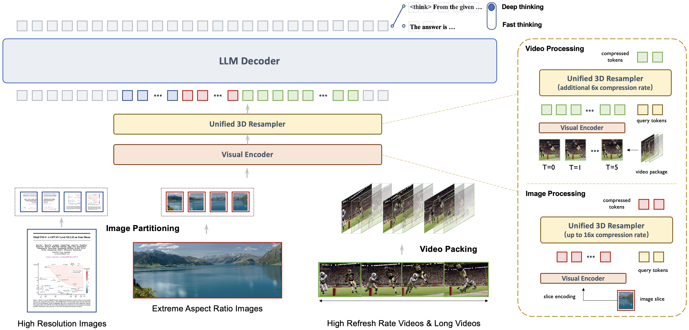
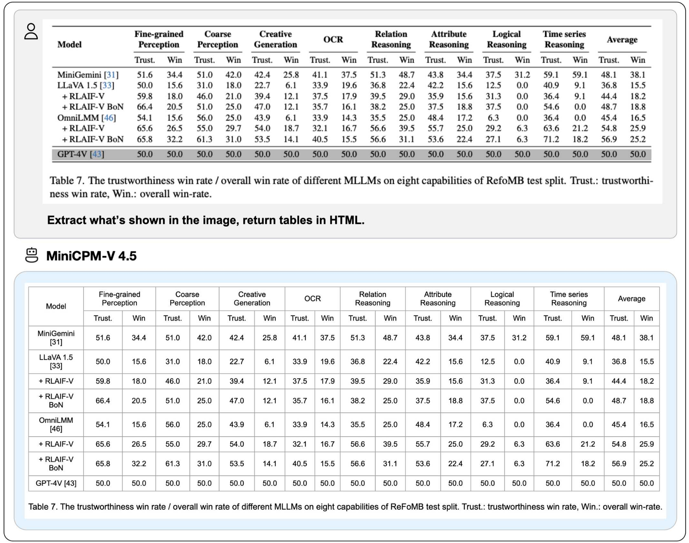
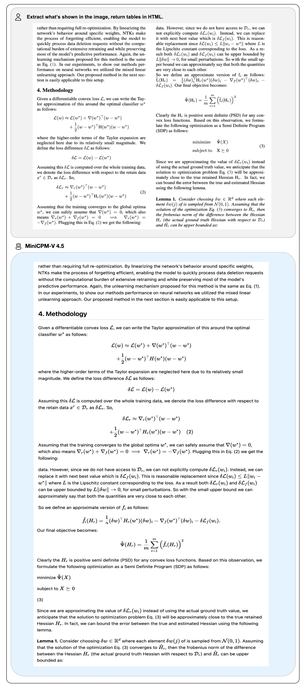
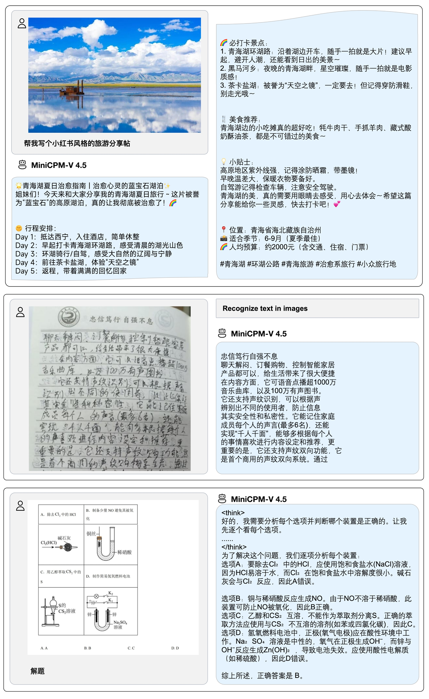
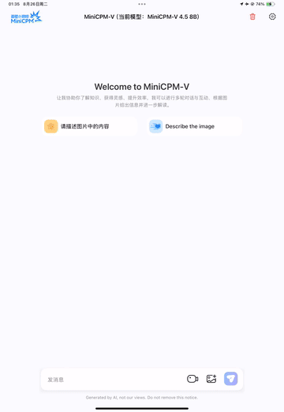
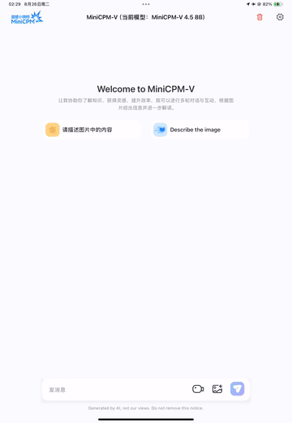

## MiniCPM-V 4.5

> Archieve at: 2026-02-03

**MiniCPM-V 4.5** is the latest and most capable model in the MiniCPM-V series. The model is built on Qwen3-8B and SigLIP2-400M with a total of 8B parameters. It exhibits a significant performance improvement over previous MiniCPM-V and MiniCPM-o models, and introduces new useful features. Notable features of MiniCPM-V 4.5 include:

- 🔥 **State-of-the-art Vision-Language Capability.**
  MiniCPM-V 4.5 achieves an average score of 77.0 on OpenCompass, a comprehensive evaluation of 8 popular benchmarks. **With only 8B parameters, it surpasses widely used proprietary models like GPT-4o-latest, Gemini-2.0 Pro, and strong open-source models like Qwen2.5-VL 72B** for vision-language capabilities, making it the most performant MLLM under 30B parameters.

- 🎬 **Efficient High-FPS and Long Video Understanding.** Powered by a new unified 3D-Resampler over images and videos, MiniCPM-V 4.5 can now achieve 96x compression rate for video tokens, where 6 448x448 video frames can be jointly compressed into 64 video tokens (normally 1,536 tokens for most MLLMs). This means that the model can perceive significantly more video frames without increasing the LLM inference cost. This brings state-of-the-art high-FPS (up to 10FPS) video understanding and long video understanding capabilities on Video-MME, LVBench, MLVU, MotionBench, FavorBench, etc., efficiently.

- ⚙️ **Controllable Hybrid Fast/Deep Thinking.** MiniCPM-V 4.5 supports both fast thinking for efficient frequent usage with competitive performance, and deep thinking for more complex problem solving. To cover efficiency and performance trade-offs in different user scenarios, this fast/deep thinking mode can be switched in a highly controlled fashion.

- 💪 **Strong OCR, Document Parsing and Others.**
Based on [LLaVA-UHD](https://arxiv.org/pdf/2403.11703) architecture, MiniCPM-V 4.5 can process high-resolution images with any aspect ratio and up to 1.8 million pixels (e.g., 1344x1344), using 4x fewer visual tokens than most MLLMs. The model achieves **leading performance on OCRBench, surpassing proprietary models such as GPT-4o-latest and Gemini 2.5**. It also achieves state-of-the-art performance for PDF document parsing capability on OmniDocBench among general MLLMs. Based on the latest [RLAIF-V](https://github.com/RLHF-V/RLAIF-V/) and [VisCPM](https://github.com/OpenBMB/VisCPM) techniques, it features **trustworthy behaviors**, outperforming GPT-4o-latest on MMHal-Bench, and supports **multilingual capabilities** in more than 30 languages.

-  💫  **Easy Usage.**
MiniCPM-V 4.5 can be easily used in various ways: (1) [llama.cpp](https://github.com/tc-mb/llama.cpp/blob/Support-MiniCPM-V-4.5/docs/multimodal/minicpmv4.5.md) and [ollama](https://github.com/tc-mb/ollama/tree/MIniCPM-V) support for efficient CPU inference on local devices, (2) [int4](https://huggingface.co/openbmb/MiniCPM-V-4_5-int4), [GGUF](https://huggingface.co/openbmb/MiniCPM-V-4_5-gguf) and [AWQ](https://github.com/tc-mb/AutoAWQ) format quantized models in 16 sizes, (3) [SGLang](https://github.com/tc-mb/sglang/tree/main) and [vLLM](#efficient-inference-with-llamacpp-ollama-vllm) support for high-throughput and memory-efficient inference, (4) fine-tuning on new domains and tasks with [Transformers](https://github.com/tc-mb/transformers/tree/main) and [LLaMA-Factory](./docs/llamafactory_train_and_infer.md), (5) quick [local WebUI demo](#chat-with-our-demo-on-gradio), (6) optimized [local iOS app](https://github.com/tc-mb/MiniCPM-o-demo-iOS) on iPhone and iPad, and (7) online web demo on [server](http://101.126.42.235:30910/). See our [Cookbook](https://github.com/OpenSQZ/MiniCPM-V-CookBook) for full usage!

### Key Techniques <!-- omit in toc -->

- **Architechture: Unified 3D-Resampler for High-density Video Compression.** MiniCPM-V 4.5 introduces a 3D-Resampler that overcomes the performance-efficiency trade-off in video understanding. By grouping and jointly compressing up to 6 consecutive video frames into just 64 tokens (the same token count used for a single image in MiniCPM-V series), MiniCPM-V 4.5 achieves a 96× compression rate for video tokens. This allows the model to process more video frames without additional LLM computational cost, enabling high-FPS video and long video understanding. The architecture supports unified encoding for images, multi-image inputs, and videos, ensuring seamless capability and knowledge transfer.

- **Pre-training: Unified Learning for OCR and Knowledge from Documents.** Existing MLLMs learn OCR capability and knowledge from documents in isolated training approaches. We observe that the essential difference between these two training approaches is the visibility of the text in images. By dynamically corrupting text regions in documents with varying noise levels and asking the model to reconstruct the text, the model learns to adaptively and properly switch between accurate text recognition (when text is visible) and multimodal context-based knowledge reasoning (when text is heavily obscured). This eliminates reliance on error-prone document parsers in knowledge learning from documents, and prevents hallucinations from over-augmented OCR data, resulting in top-tier OCR and multimodal knowledge performance with minimal engineering overhead.

- **Post-training: Hybrid Fast/Deep Thinking with Multimodal RL.** MiniCPM-V 4.5 offers a balanced reasoning experience through two switchable modes: fast thinking for efficient daily use and deep thinking for complex tasks. Using a new hybrid reinforcement learning method, the model jointly optimizes both modes, significantly enhancing fast-mode performance without compromising deep-mode capability. Incorporated with [RLPR](https://github.com/OpenBMB/RLPR) and [RLAIF-V](https://github.com/RLHF-V/RLAIF-V), it generalizes robust reasoning skills from broad multimodal data while effectively reducing hallucinations.

### Evaluation  <!-- omit in toc -->

  

### Inference Efficiency 

**OpenCompass**

<table style="margin: 0px auto;">
    <thead>
            <tr>
              <th align="left">Model</th>
              <th>Size</th>
              <th>Avg Score ↑</th>
              <th>Total Inference Time ↓</th>
            </tr>
    </thead>
    <tbody align="center">
        <tr>
            <td nowrap="nowrap" align="left">GLM-4.1V-9B-Thinking</td>
            <td>10.3B</td>
            <td>76.6</td>
            <td>17.5h</td>
        </tr>
        <tr>
            <td nowrap="nowrap" align="left">MiMo-VL-7B-RL</td>
            <td>8.3B</td>
            <td>76.4</td>
            <td>11h</td>
        </tr>
        <tr>
            <td nowrap="nowrap" align="left">MiniCPM-V 4.5</td>
            <td>8.7B</td>
            <td><b>77.0</td>
            <td><b>7.5h</td>
        </tr>
    </tbody>
</table>

**Video-MME**

<table style="margin: 0px auto;">
    <thead>
          <tr>
              <th align="left">Model</th>
              <th>Size</th>
              <th>Avg Score ↑</th>
              <th>Total Inference Time ↓</th>
              <th>GPU Mem ↓</th>
          </tr>
    </thead>
    <tbody align="center">
          <tr>
              <td nowrap="nowrap" align="left">Qwen2.5-VL-7B-Instruct</td>
              <td>8.3B</td>
              <td>71.6</td>
              <td>3h</td>
              <td>60G</td>
          </tr>
          <tr>
              <td nowrap="nowrap" align="left">GLM-4.1V-9B-Thinking</td>
              <td>10.3B</td>
              <td><b>73.6</td>
              <td>2.63h</td>
              <td>32G</td>
          </tr>
          <tr>
              <td nowrap="nowrap" align="left">MiniCPM-V 4.5</td>
              <td>8.7B</td>
              <td>73.5</td>
              <td><b>0.26h</td>
              <td><b>28G</td>
        </tr>
    </tbody>
</table>

Both Video-MME and OpenCompass were evaluated using 8×A100 GPUs for inference. The reported inference time of Video-MME includes full model-side computation, and excludes the external cost of video frame extraction (dependent on specific frame extraction tools) for fair comparison.

### Examples  <!-- omit in toc -->

  

  
  
  

Click to view more cases.

  

We deploy MiniCPM-V 4.5 on iPad M4 with [iOS demo](https://github.com/tc-mb/MiniCPM-o-demo-iOS). The demo video is the raw screen recording without edition.

<table align="center"> 
    

      
      &nbsp;&nbsp;&nbsp;&nbsp;
      
    

    

      
      &nbsp;&nbsp;&nbsp;&nbsp;
      
    

</table>

