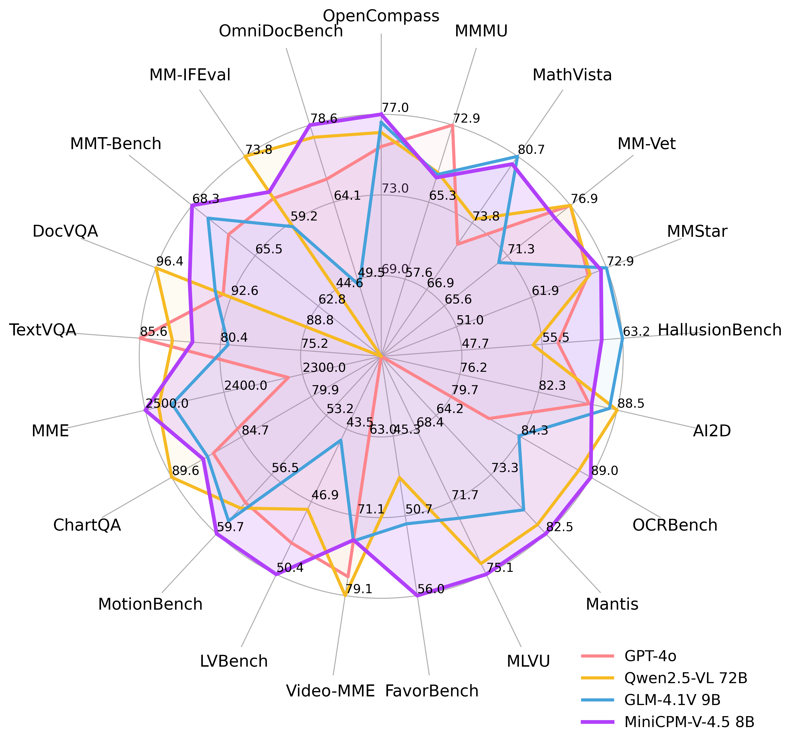
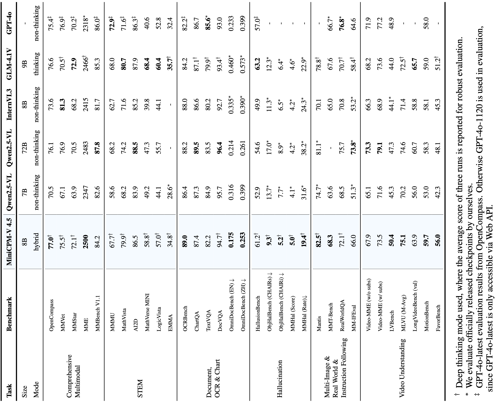
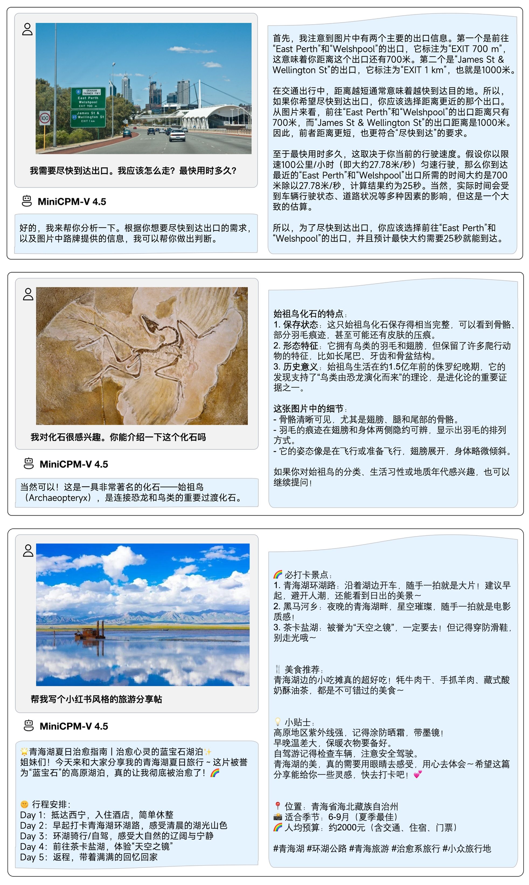
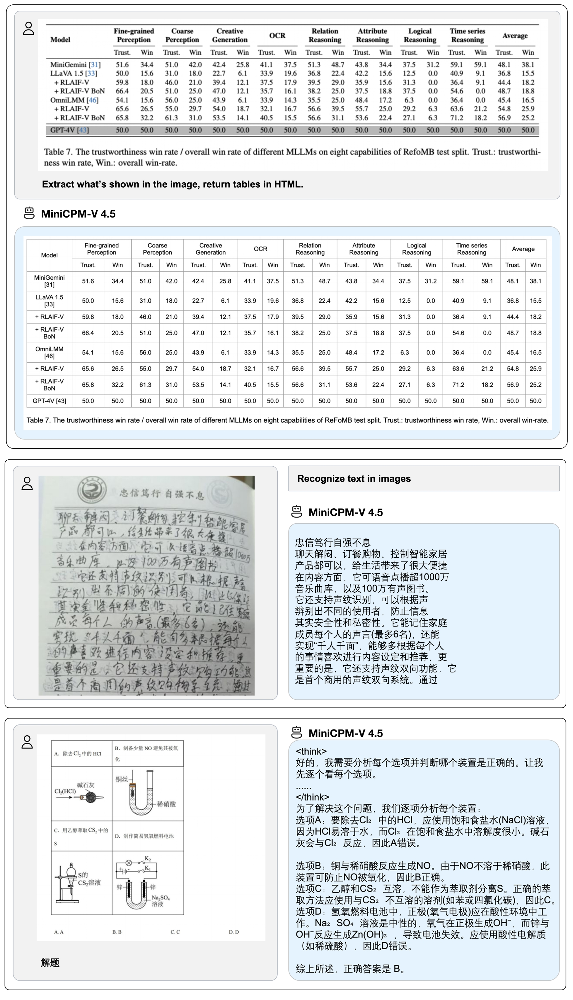
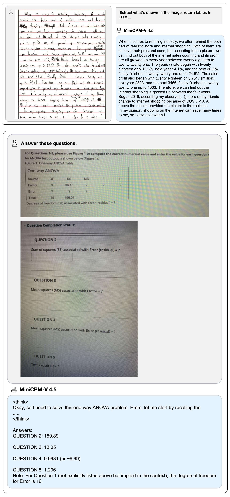

## MiniCPM-V 4.5

> Archieve at: 2026-02-03

**MiniCPM-V 4.5** 是 MiniCPM-V 系列中最新、最强大的模型。该模型基于 Qwen3-8B 与 SigLIP2-400M 构建，总参数量为 8B。其在性能上较前代 MiniCPM-V 与 MiniCPM-o 有显著提升，并引入了一系列全新的实用特性。其主要亮点包括：

- 🔥 **领先的视觉理解能力**
  MiniCPM-V 4.5 在 OpenCompass 综合评测（涵盖 8 个主流评测基准）中取得了 77.0 的高分。**在仅 8B 参数的情况下超越了广泛使用的闭源模型（如 GPT-4o-latest、Gemini-2.0 Pro）以及强大的开源模型（如 Qwen2.5-VL 72B）**，成为 30B 参数规模以下最强的多模态大模型。

- 🎬 **高效的高帧率与长视频理解** 
  借助全新的图像-视频统一 3D-Resampler，MiniCPM-V 4.5 能够实现 96 倍视频 token 压缩率，即将 6 帧 448x448 视频帧联合压缩为 64 个 token（大多数多模态大模型需约 1536 个 token）。这意味着模型在语言模型推理成本不增加的情况下，可以感知显著更多的视频帧，从而实现业界领先的 高帧率（最高 10FPS）视频理解与长视频理解，并在 Video-MME、LVBench、MLVU、MotionBench、FavorBench 等基准上高效率地展现出色性能。

- ⚙️ **可控的快思考 / 深思考模式**  
  MiniCPM-V 4.5 同时支持 快思考（用于高频高效推理，性能具竞争力）与 深思考（用于复杂问题求解）。用户可根据不同场景对效率与性能的权衡，自由切换两种模式，实现高度可控的推理过程。

- 💪 **优秀的 OCR、文档解析与多语言能力**
  基于 [LLaVA-UHD](https://arxiv.org/pdf/2403.11703) 架构，MiniCPM-V 4.5 能处理任意长宽比、最高达 180 万像素（如 1344x1344） 的高分辨率图像，同时使用的视觉 token 数仅为多数 MLLM 的 1/4。其在 OCRBench 上取得超越 GPT-4o-latest 与 Gemini 2.5 等闭源模型的性能，并在 OmniDocBench 上展现了业界顶尖的 PDF 文档解析能力。借助最新的 [RLAIF-V](https://github.com/RLHF-V/RLAIF-V/) 和 [VisCPM](https://github.com/OpenBMB/VisCPM) 技术，模型在可靠性上表现优异，在 MMHal-Bench 上超越 GPT-4o-latest，并支持 30+ 种语言的多语言能力。

-  💫 **便捷易用的部署方式**
  MiniCPM-V 4.5 提供丰富灵活的使用方式：(1) [llama.cpp](https://github.com/tc-mb/llama.cpp/blob/master/docs/multimodal/minicpmo4.5.md) 与 [ollama](https://github.com/tc-mb/ollama/tree/MIniCPM-V) 支持本地 CPU 高效推理；(2) 提供 [int4](https://huggingface.co/openbmb/MiniCPM-V-4_5-int4)、[GGUF](https://huggingface.co/openbmb/MiniCPM-V-4_5-gguf)、[AWQ](https://github.com/tc-mb/AutoAWQ) 等 16 种规格的量化模型；(3)兼容 SGLang 与 [vLLM](#efficient-inference-with-llamacpp-ollama-vllm) (4) 借助 [Transformers](https://github.com/tc-mb/transformers/tree/main) 与 [LLaMA-Factory](./docs/llamafactory_train_and_infer.md) 在新领域与任务上进行微调；(5) 快速启动本地 [WebUI demo](#chat-with-our-demo-on-gradio)；(6) 优化适配的 [iOS 本地应用](https://github.com/tc-mb/MiniCPM-o-demo-iOS)，可在 iPhone 与 iPad 上高效运行；(7) 在线 [Web demo](http://101.126.42.235:30910/) 体验。更多使用方式请见 [Cookbook](https://github.com/OpenSQZ/MiniCPM-V-CookBook)。

### 技术亮点 <!-- omit in toc -->

- **架构：图像-视频统一的高密度视觉压缩 3D-Resampler**。 MiniCPM-V 4.5 在架构上引入了 3D-Resampler，成功突破了视频理解任务中性能与效率难以兼得的瓶颈。该方法能够将多达 6 帧连续视频帧压缩为仅 64 个 token（与 MiniCPM-V 系列中单张图像所用的 token 数相同），从而实现 96× 的视频 token 压缩率。这使得模型在语言模型计算成本不增加的情况下，可以处理更多的视频帧，从而实现高帧率视频理解和长视频理解。该架构统一支持单图、多图和视频的编码处理，确保了能力与知识的无缝迁移。

- **学习机制：OCR与文档知识的统一学习**。现有多模态大模型一般在不同训练阶段分别单独训练 OCR 能力与文档知识。我们发现这两个训练过程的本质差异在于图像中文本的可见性。通过动态对文档文本区域施加不同强度的噪声干扰，并要求模型重建文本，使其学会自适应地在准确文本识别（当文本清晰时）与基于多模态上下文的知识推理（当文本严重遮挡时）之间切换。这种方法使得 MiniCPM-V 在文档知识学习中摆脱了对高错误率的文档解析器的依赖，同时避免了过度增强的 OCR 数据产生的幻觉问题，以最小工程开销实现了顶尖的 OCR 与多模态知识处理性能。

- **后训练优化：基于多模态强化学习的混合快思考/深度思考模式**。 MiniCPM-V 4.5 通过两种可切换推理模式提供均衡的体验：面向高效日常应用的快速思考模式，以及处理复杂任务的深度思考模式。采用新颖的混合强化学习方法，模型可联合优化两种模式，在保持深度模式能力的同时显著提升快速模式性能。结合 [RLPR](https://github.com/OpenBMB/RLPR) 和 [RLAIF-V](https://github.com/RLHF-V/RLAIF-V) 技术，该模型可以从海量多模态数据中泛化出强大的推理能力，并有效减少幻觉现象。

### 性能评估 <!-- omit in toc -->

  

### 推理效率 <!-- omit in toc -->

**OpenCompass**

<table style="margin: 0px auto;">
    <thead>
            <tr>
              <th align="left">Model</th>
              <th>Size</th>
              <th>Avg Score ↑</th>
              <th>Total Inference Time ↓</th>
            </tr>
    </thead>
    <tbody align="center">
        <tr>
            <td nowrap="nowrap" align="left">GLM-4.1V-9B-Thinking</td>
            <td>10.3B</td>
            <td>76.6</td>
            <td>17.5h</td>
        </tr>
        <tr>
            <td nowrap="nowrap" align="left">MiMo-VL-7B-RL</td>
            <td>8.3B</td>
            <td>76.4</td>
            <td>11h</td>
        </tr>
        <tr>
            <td nowrap="nowrap" align="left">MiniCPM-V 4.5</td>
            <td>8.7B</td>
            <td><b>77.0</td>
            <td><b>7.5h</td>
        </tr>
    </tbody>
</table>

**Video-MME**

<table style="margin: 0px auto;">
    <thead>
          <tr>
              <th align="left">Model</th>
              <th>Size</th>
              <th>Avg Score ↑</th>
              <th>Total Inference Time ↓</th>
              <th>GPU Mem ↓</th>
          </tr>
    </thead>
    <tbody align="center">
          <tr>
              <td nowrap="nowrap" align="left">Qwen2.5-VL-7B-Instruct</td>
              <td>8.3B</td>
              <td>71.6</td>
              <td>3h</td>
              <td>60G</td>
          </tr>
          <tr>
              <td nowrap="nowrap" align="left">GLM-4.1V-9B-Thinking</td>
              <td>10.3B</td>
              <td><b>73.6</td>
              <td>2.63h</td>
              <td>32G</td>
          </tr>
          <tr>
              <td nowrap="nowrap" align="left">MiniCPM-V 4.5</td>
              <td>8.7B</td>
              <td>73.5</td>
              <td><b>0.26h</td>
              <td><b>28G</td>
        </tr>
    </tbody>
</table>

OpenCompass 和 Video-MME 均采用 A100*8卡 推理，其中 Video-MME 的推理时间未统计视频抽帧时间

### 典型示例 <!-- omit in toc -->

  

  
  

点击查看更多示例

  
  

我们使用 [iOS demo](https://github.com/tc-mb/MiniCPM-o-demo-iOS) 将 MiniCPM-V 4.5 部署在 iPad M4 ，并录制以下演示录屏，视频未经任何编辑。

<table align="center"> 
    

      
      &nbsp;&nbsp;&nbsp;&nbsp;
      
    

    

      
      &nbsp;&nbsp;&nbsp;&nbsp;
      
    

</table>

